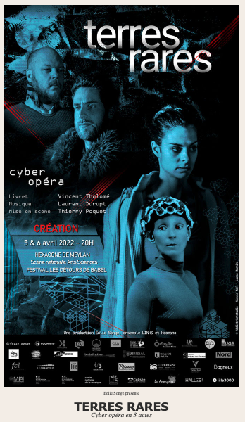
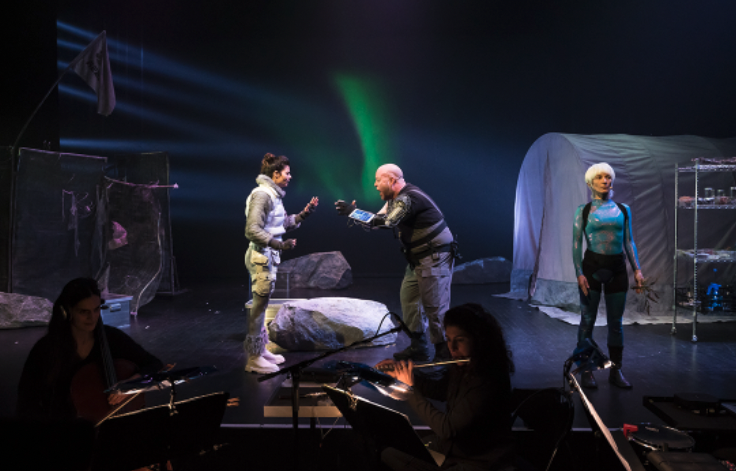
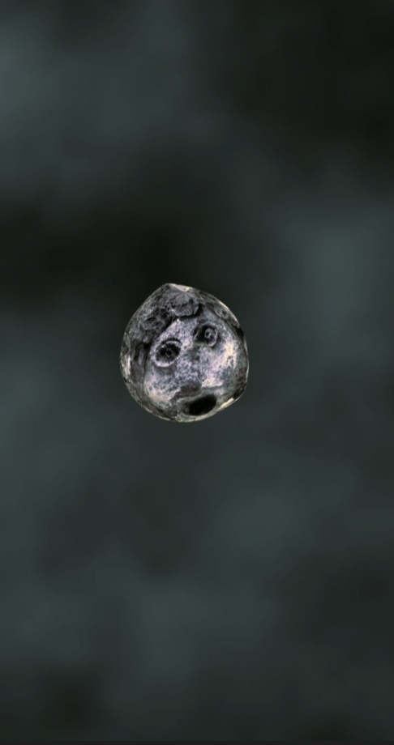
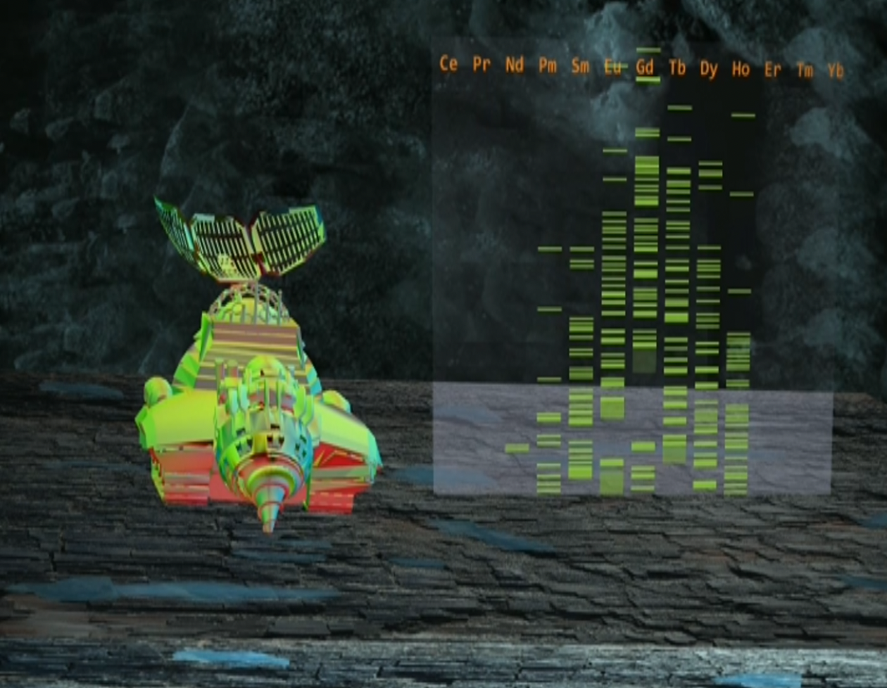
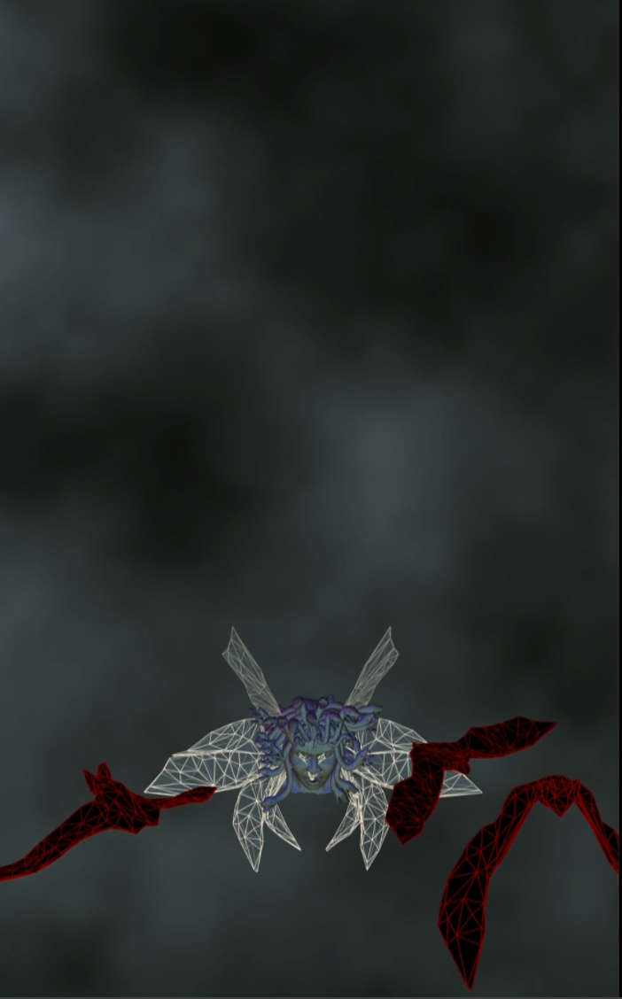
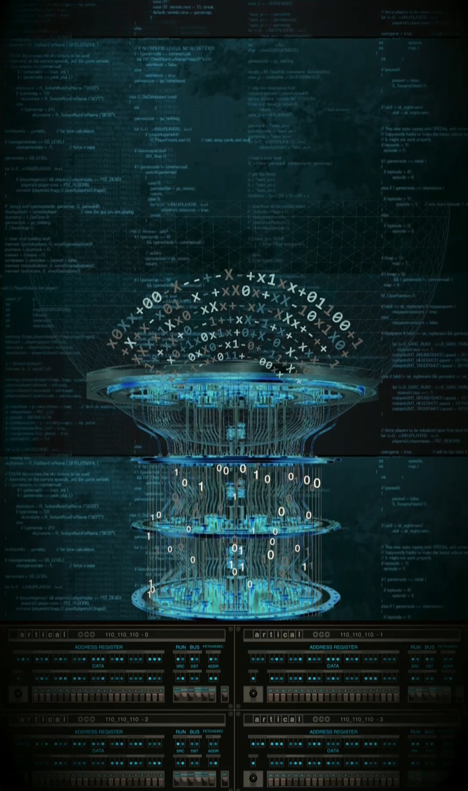

# About Cyber Opera "Terres rares"  
This framework was designed to realize animations for a cyber Opera in France.  
This gallery to give ideas with some creations in p5 with this framework.     

## cyber opera 
   

 

The display (on right) was on a 3840 height x 1080 width composed of two huge screens in portrait mode.    
I develop with such a canvas in P5 and use two monitors connected to a mac M1.   
Below some (rather low quality) images to show what we can do with p5 and webgl.
### moon climbing 
   

The background was created with p5 using a perlin noise effect.    
The moon is climbing then go away very fast using a bezier journey out of range 0..1.1 

### mining robot 
   

An mining robot progress in a cave while analysing lanthanid spectrum.  
Several layers of p5 instances with canvas superimposed.   

### regeneration of nature
     

A kind of mythological genius travels through space, turning slowly on itsleft and generates clumps of grass that fall on the ground.   
Several objects are moving. Each one run its own scenario and trajectory.   
A .obj is cloned 6 times all linked in a common moveableObject. 
### Medusa 

Medusa rides some kind of daisy monster which turns out to be a group of bats taking off as it goes.  
Grouping, ungrouping of models.   
Autonomous fly for each bat with a built-in scenario in class.  
Colors effects in time.    

### Computer & IA 

A wink on the history of computer science with a bunch of PDP-11 at bottom surrounded by a quantum computer showered by a rising rain of binary and a fan of hexadecimal numbers. Code scrolling in background.    
Several animated layers with instance of p5, cache on the fly of generated graphics.   

