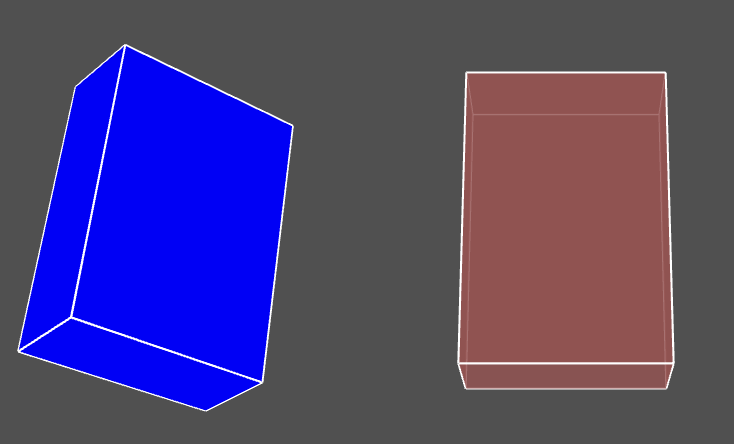

# Useful in js projects : Literal objects
 A literal object is a data structure using key-value pairs and curly braces in any combination.     
 Use them to hold internal data of objects: This avoid to create discrete variables and simplify generic behaviours.    
 In my code the holder of data is generally named *config*, short of *configuration*    
 Despite a literal can hold any value, including specific objects, here we stay in JSON compatible literals, with native js values.  
### declare a literal 
```javascript 
 config = {
    stroke: { active: true, color: "white", weight: 1 },
    fill: { active: false, color: "grey" },
  };
  ```
  Note : you can also use a JSON string to create a literal.
  ```
  var config = JSON.parse(
  '{"stroke":{"active":true,"color":"white","weight":1},"fill":{"active":false,"color":"grey"}}')
```

## copy a literal as a new one
Don't reinvent the wheel : 
```javascript 
function copyConfig(source) {
  // the simplest way is to serialize then deserialize the structure
  var newConfig = JSON.parse(JSON.stringify(source));
  return newConfig;
}
```
I use *copyConfig* to share a unique structure in a class definition, structure which is copied in each new object to insure their independancy. 
## patch a literal (with another literal)  : patchConfig
This function *patch* an existing literal with another that holds any parts or subparts of the destination.      
This allow to only describe the differences with the reference to update the config.     
*patch* check that the keys of the patch already exist inside the destination. (Main drawback of literal are typo errors).   
It also inform if the value of a key has changed of nature : real request or thoughtlessness? 
## extend a literal (with another literal) : extendConfig
In some case, it is useful to add new properties not yet included in the previous structure.   
*extendsConfig* works like *patchConfig* (can change values of named keys) but allow creation of new key-value pairs.        
*extendConfig* is used to complete at each level of inheritance the default config with the data of the new level. 
# literals in a class hierarchy 
One can use static literal to define a default data structure for the future objects. 
```javascript 
class GraphicObject {
  static config = {
    name: "no name", // to facilitate debug, give a name to your objects
    visible: true, // if false, object is not drawn
    position: [0, 0, 0], // current location of object to draw it
    rotation: [20, 0, 0], // ( degrees )current rotation of object. order is rotateX, then Y , then Z
    scale: [1, 1, 1], // optional scale in the 3 directions
    // screen drawing
    stroke: { active: true, color: "white", weight: 1 },
    //fill: { active: false, color: "grey" },
    fill: { active: true, color: [200,100,100,200]}
  };  
    constructor(instanceConfigVariant) {
    this.config = copyConfig(GraphicObject.config);
    if(instanceConfigVariant != null ) this.patchConfig(instanceConfigVariant)
  }
  ...
    drawModel() {
    box(100, 150, 50);
  }
  ```
The constructor receive an optional literal to patch any part of the default config.   
Default config is copied then patched and result belongs to the new object.  
( *this.patchConfig...* is a simplified call for  ```this.config = patchConfig(this.config,instanceConfigVariant)```)

### Samples of instance creation 
```javascript   
 obj_1 = new GraphicObject();
 // constructor with patch to apply to default config
 obj_2 = new GraphicObject({
    position: [-200, 0, 0], 
    rotation: [30, 45, 0], 
    fill: { color: 'blue' }
 })
 ...
 obj_1.draw();
 obj_2.draw();
  ```
  </img>
 
### replacement reminder 
The value of a key can be a simple value , a collection {...} or an array [...]
Replacement of a key value by another category can be intentional or not.  
The *patchConfig* function throws **verbose level messages** to the console to remind the decision.  
In the previous example, it throws :  ```color:[200,100,100,200] replaced by "blue" ```
which is an acceptable replacement: in p5 a color may have many syntax.   
## subclass and extendsConfig 
A subclass will bring its own extension to the parent's config with its own static config.
Here the new class will work with obj models.   
```javascript 
class GraphicObjectModel extends GraphicObject {
  static config = {
    model: null, // the shape to draw
    texture: { active:false, image: null } // optional texture
  };
  constructor(instanceConfigVariant) {
    super();  
    // add local default extension
    this.extendConfig(copyConfig(GraphicObjectModel.config));
    // apply variant if called with
    if (instanceConfigVariant != null) this.patchConfig(instanceConfigVariant);
  }
  // overWritten method
  drawModel() {
    if (this.config.texture.active) texture(this.config.texture.image);
    model(this.config.model);
  }
}
  ```
In P5, it's better to preload models and images in the *preload* function : 
```javascript 
let cola_cup, textureWater;
function preload() {
  cola_cup = loadModel("../../models/cola_cup.obj");//free obj from turbosquid.com author:rozenkrantz
  textureWater = loadImage("../../textures/water.jpg")
}
```
you can create objects with different flavour using variants : 
```javascript 
  let aCup = new GraphicObjectModel({
    model: cola_cup,
    texture: { active: true, image: textureWater },
    name: "my favorite cup",
    fill: { active: true, color: "red" },
    stroke: { color: "darkred"}
  });
  myCups.push(aCup);
  aCup = new GraphicObjectModel({
    model: cola_cup,
    texture: { active: true, image: textureWater},
    name: "my beautiful cup",
    stroke: { active: false},
    position: [100,100,0]
  });
  myCups.push(aCup);
```
</img>   
Notice that the model (p5.Geometry) will be shared by all instances as we reuse it without copying it before. That is what we want in this case. The same for texture image.  
The controls made on structure throws messages onto the debug console to follow what happens for the two object's construction:    
</img> 
## accessing data  
In your code, any data can be get or set with either a dot notation or an array notation : 
``` javascript 
 obj_1.config.fill.color = 'yellow'
 obj_1.config["fill"]["color"]= 'orange' 
 obj_2.config.stroke.active = false; 
 obj_2.config["stroke"]["active"] = true;
 console.log(obj_2.config);
```
### interpreted values 
The array notation is useful to manipulate the config with string keys. These strings can be part of a metamodel to act on the objects, for example being stored in a config file.   
The framework introduces an helper to avoid to manipulate an array of strings: a dot notation:
``` javascript    
obj_1.setData("fill.color","white");
obj_1.setData("position[0]",120);
if (obj_1.getData("stroke.active")== false) ... 
```
This kind of notation will be used in the framework to act on the values during a scenario externally configured.  

# summary 
Literals are useful to hold object's data in a structured manner   
Some defaults and some controls are easy to do using static configuration in a class hierarchy.   
## learn more on github 
*util/utilConfig.js*  the library    
*sketchs/basicObject*  folder for example with obj_1 obj_2   
*sketchs/cupOfCoke*    folder for example with cups   
### to do next 
Have a look on *scenario.md* to animate your objects with a basic example :*sketchs/traffic_lights* 