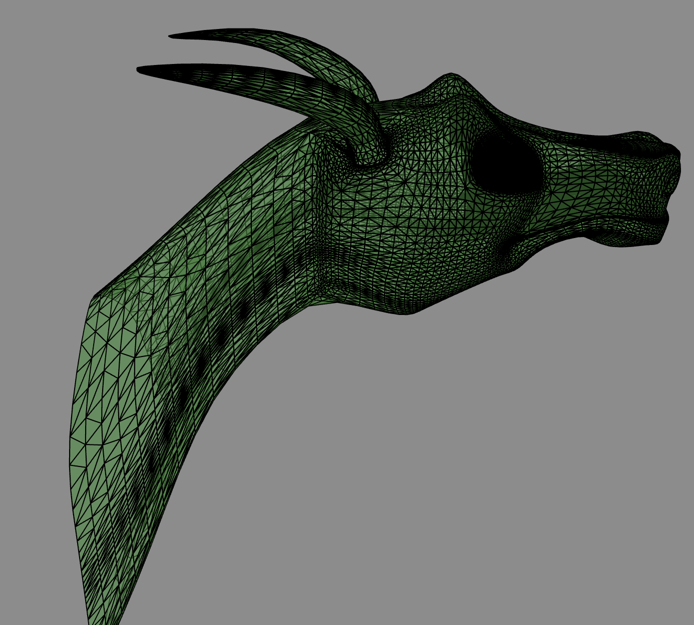
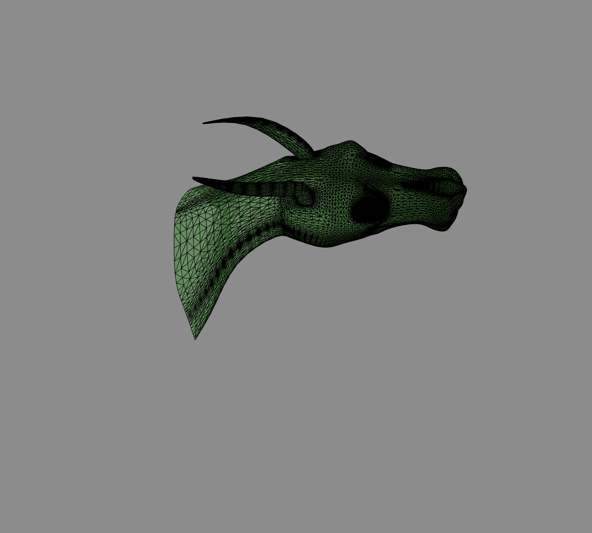
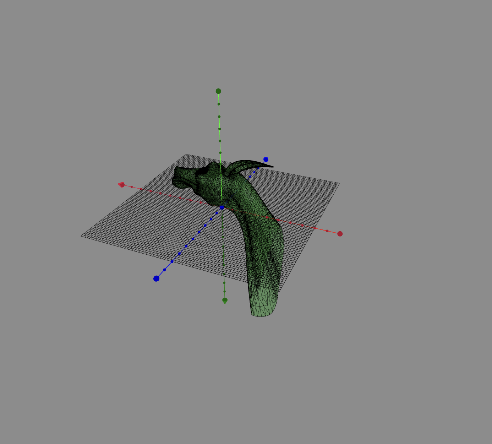

# camera movement 
Another use of journeys and literals is moving the camera.    
As camera is already a component of p5, we define a class Tripod to hold cameras. 
## Tripod class 
A tripod is a component localized in space like any other *GraphicObjects* with some specific methods  and a *setData* overwritten : 

```javascript 
class Tripod extends GraphicObject {
  // specific for this level
  static config = {
    position: [0,0,700],
    lookAt: [0, 0, 0],
  };
... 
  /*  mounting a camera on a tripod will give the camera the tripod position  */
  mountCamera(someCamera) { ... } 
  /* mountUnderCamera  : the tripod will take the current camera values */
  mountUnderCamera(someCamera) {... } 
/*
  refreshCameraPosition: propagate the tripod position to the real camera . 
  If code changes directly the tripod data, it must call refreshCameraPosition to see changes
*/
  refreshCameraPosition() {... } 
  /*
    setData is overwritten to propagate changes
  */
  setData(somePath, newValue) {
    setDataConfig(this.config, somePath, newValue);
    this.refreshCameraPosition();
  }
}
```
### sample 
It is better to create scenarios, scripts and journeys in the setup of p5 to be sure everytjong is well initialized. For code readibility, this is done in separated functions:    
```javascript 
function setup() {
  can = createCanvas(800, 800, WEBGL);
  dragon = new GraphicObjectModel({...});
  // dealing with cameras 
  camera1 = createCamera();
  // better to create in setup
  createTripods();
  // create Scenario 
  createScenariosAndJourneys();
  // start the scenario
  scenarioCamera.start();
}
``` 
#### scenario test 
```javascript 
function createScenariosAndJourneys(){
  /*
 the demo scenario chains: 
 - a first script to alternate between two tripods 
 - a second script where a camera follows a defined journey 
*/

scenarioCamera = new Scenario(
  { scenarioName: "demo camera", trace: true},
  [
    { scriptName: "alternate", instance: alternate()},
    { scriptName: "zoom and move", instance: scriptJourney(journeyCam,tripodA)},
  ])
}
...
```  
#### alternate tripods 
```javascript 
/*
 a first script that alternate the point of view 5 times by changing camera1 of tripod 
*/
function* alternate(){
  yield 2000 // wait a bit
  for (let i=0;i<5;i++){
    // start by front camera 
    tripodA.mountCamera(camera1)
    dragon.config.stroke.color = [0,50,150]; // blue-green
    yield 1000
    tripodB.mountCamera(camera1);
    dragon.config.stroke.color = 'darkred';
    yield 1000
  } 
  // leave with front camera 
  tripodA.mountCamera(camera1) 
  dragon.config.stroke.color = 'black';
  yield 2000 // wait another bit before chaining 
}
```
For tuto purposes, we change the dragon's color while changing point of view:     
</img>
</img>
#### camera movement using journeyScript 
As for other pieces like dragon, we can move a tripod using a journey definition : 

```javascript 
/*
  define a trajectory for a mmovement of camera 
*/
var journeyCam = {
  duration_ms: 10000, // duration of the journey
  parameters: [
    {
      name: "position", 
      end: [100,-700,1000]
    },
    {
      name: "lookAt", 
      wait_ms: 8000,
      end: [0,0,300]
    },
  ]
}
```
As we define no more options, the movement will be a linear one for the two parameters.     
The journey is started in the scenario by:    
```{ scriptName: "zoom and move", instance: scriptJourney(journeyCam,tripodA)} ```   
This define a trajectory, starting at current position and lookat (no start entries in parameters) ending at the defined values :    
</img>
</img>

#### some helper with keyboard
One can see in the draw loop a call to ** kbHelp();**
```javascript 
function draw() {
  kbHelp();
  dragon.draw();
}
``` 
Some helps are available by striking some key ( focus mut be on html page, not in the console area ). 
In the console, can see doc with 'h' key :    
</img>

These two kb keys add elements to the canvas :    
</img>    
These keys act as toggle options. 


#### next : special trajectories 
for now, we define only linear trajectory and some optional non linear timing with *easingOnT*
special trajectories will include **Bezier curves** 