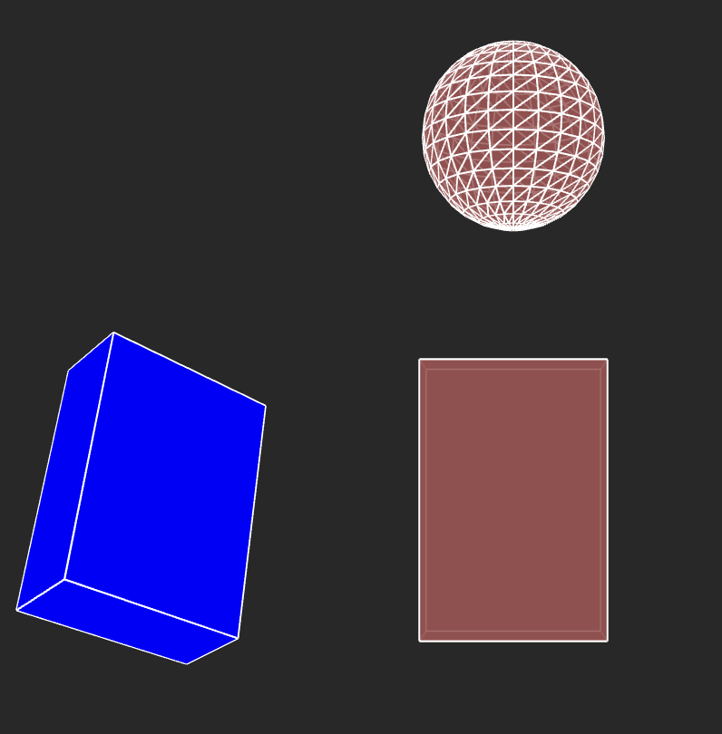
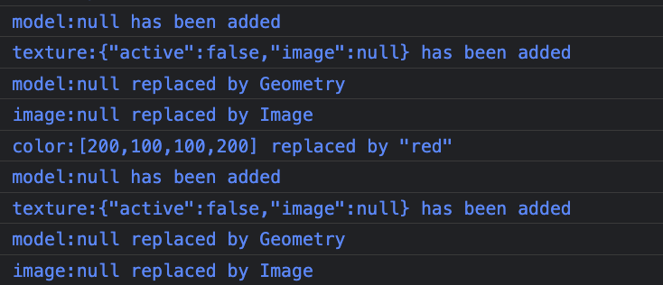

# Developing graphic objects 
Some classes to develop more quickly in p5. 
(In *graphicObject.js* source code )
## class MoveableObject 
A simple class to hold properties in a literal object with a default configuration: 
``` javascript 
class MoveableObject {
  // Default config of this level
  static config = {
    name: "moveableObject no name", // to facilitate debug, give a name to your objects
    position: [0, 0, 0], // current location of object to draw it
    angleMode: null,  // what's the unit of angle . If not set use current angleMode 
    rotation: [0, 0, 0], // current rotation of object. order is: rotateX, then Y , then Z
    scale: [1, 1, 1], // optional scale in the 3 directions
  };
  ```  
  The parameters speak for themselves.  
  *Just a word about **angleMode** : in some case (reuse of components) the expected *angleMode* to draw itself is no more the current one. In these rare cases, one can precise how to interpret the rotation values : DEGREES or RADIANS for this unique object . By default when null, it uses the current mode.*  

## class GraphicObject
A inherited class with new properties to be able to draw itself.  
A default configuration is also given as a static literal object:    
```javascript 
class GraphicObject extends MoveableObject {
  static config = {
    name: "graphicObject no name ", // to facilitate debug, give a name to your objects
    visible: true, // if false, object is not drawn
    stroke: { active: true, color: "white", weight: 1 },
    fill: { active: true, color: [200, 100, 100, 200] },
  };
``` 
The class has a default method *drawModel* for debug to see something, to be overriden later as needed : 
``` javascript   
  drawModel() {
    box(100, 150, 50);
  }   
```
### simplest sample 
  
</img>   
*see sketches/ 1-basicObject/sketch.js*  

```javascript 
function setup() {
    can = createCanvas(800, 800, WEBGL)
    obj_1 = new GraphicObject();
    // constructor with patch to apply to default config
    obj_2 = new GraphicObject({
        position: [-200, 0, 0], // current location of object to draw it
        rotation: [30, 45, 0], // in degrees
        fill: { color: 'blue' }
    })
    obj_3 = new GraphicObject( {position: [0,-200,0]});
    // apply some change by code ( or make a subclass )
    obj_3.drawModel = () => sphere(50)
}

function draw() {
    orbitControl(1, 1, 1);
    background(40);
    obj_1.draw();
    obj_2.draw();
    obj_3.draw();
}
``` 
## class GraphicModelObject 
A inherited class with new properties to be able to draw itself.  
A default configuration is also given as a static literal object:  
```javascript
class GraphicObjectModel extends GraphicObject {
  static config = {
    model: null, // the shape to draw
    texture: { active:false, image: null } // optional texture
  };
```
in this default config, model and image are just placeholders to be filled in at object instanciation.  
 
 In p5 some pb can occur if *loadModel* is called outside of *preload*.   
 Our advice : 
  - code all *loadModel* and *loadImage* in preload 
  - construct *GraphicsObject* in setup with variables set previously in *preload*. 
### sample: Two cups of coke 

```javascript 
let cola_cup, textureWater;
function preload() {
  cola_cup = loadModel("../../models/cola_cup.obj");//free obj (turbosquid.com author:rozenkrantz)
  textureWater = loadImage("../../textures/water.jpg")
}

function setup() {
  can = createCanvas(800, 800, WEBGL);
  let aCup = new GraphicObjectModel({
    model: cola_cup,
    texture: { active: true, image: textureWater },
    name: "my favorite cup",
    stroke: { color: "darkred"}
  });
  myCups.push(aCup);
  aCup = new GraphicObjectModel({
    model: cola_cup,
    texture: { active: true, image: textureWater},
    name: "my beautiful cup",
    stroke: { active: false},
    position: [100,100,0]
  });
  myCups.push(aCup);
} // setup
function draw() {
  background(20);
  orbitControl(1,1,5);
  for (let aCup of myCups) aCup.draw();
}
```
</img>   
*see sketches/ 2-cupOfCoke//sketch.js*  
Notice that the obj model (which results in a *p5.Geometry*) will be shared by all instances.The same for texture image.  
#### for debug 
Some messages are thrown at the debug level on console to follow what happens for the two object's construction through the hierarchical config replacement:    
</img>   
### Use of literals in a class hierarchy 
To understand what is under the hood in the previous examples, especially with default config and inheritance, goto **chap1-Literals**