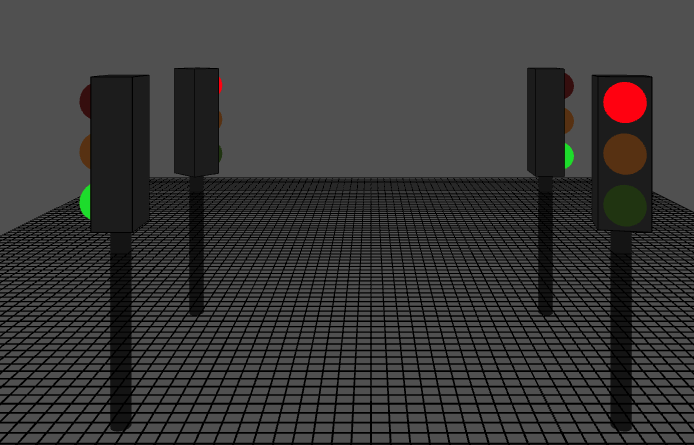
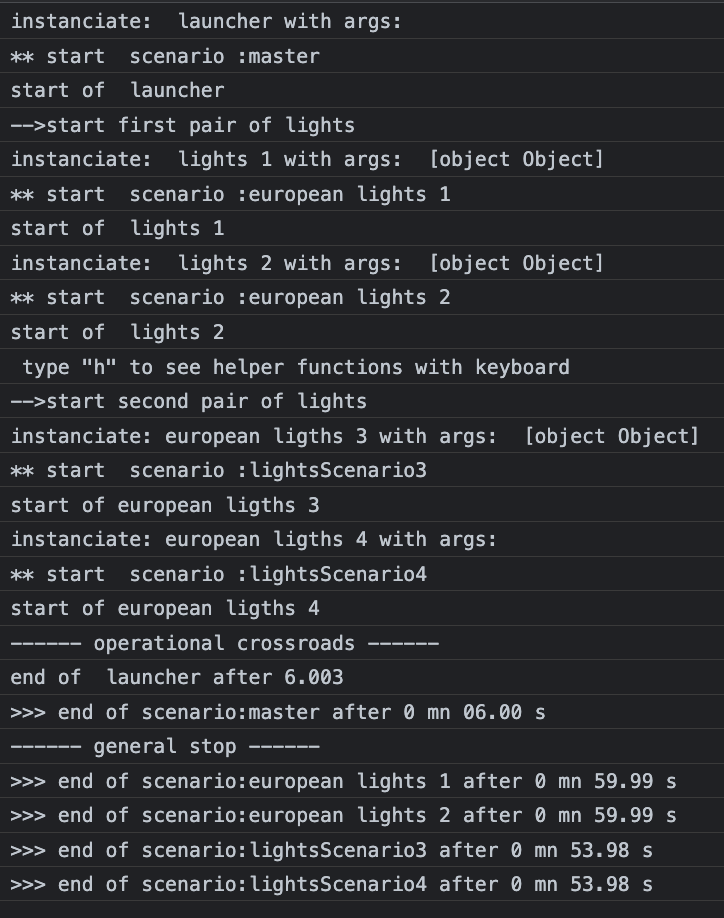

# Scenarios 
A *scenario* takes care of timing & scheduling to start, stop or wait for parts of your code.   
(Samples are coded as p5.js sketches, but scenario can be used in any js environment. )   
## scenario 
A **scenario** plays a **script**, or a series of **scripts**.    
Once a script is finished, the scenario runs the next one.    
### script vs  generator

A **generator** is a special function characterized by  declaration with a star : ```myFunction*```    
When this function is called directly,```myFunction()```, it instanciates a *script*, a kind of class holding the source code. 
=>a **script** in the framework holds the generator's function and an *instance* of this *generator*   

To execute the code, one must call a method **next()** of the script.instance.   
The code advance up to a **yield** instruction or up to its own end and returns to caller.    
To continue, caller must call again *next()*

We call a **step** a part of generator's code that run without being interrupted   
*beginning*-----step 0-----**yield**--step 1---**yield**--- etc---**yield**--- last step ---*end*
## how a scenario interacts with the underlaying generators
When a scenario starts, it get the first *generator* of its list and create an instance.   
Once started, scenario call the generator to run the next step.    
The generator executes the step then returns either by : 
- **yield** -> The scenario will wait the default *interval* ms of the scenario before calling again the script
- **yield** xxxxx   -> The scenario will wait the number xxxxx of ms before calling the next step   
- a **return** instruction  -> The scenario will stop this script . 
- the *end* of generator's code.    -> Same as above. 
    
When the script returns to the scenario *advance* method, **this method push itself in the js event loop for later**:    
 ``` javascript 
 advance() {
    var step = this.script.instance.next();
    if (!step.done) {
      var nextEcheance =
        step.value == undefined ? this.config.interval : step.value;
      // postpone its job , but wants to be recalled with its scenario context
      this.timeoutId = setTimeout(this.advance.bind(this), nextEcheance);
    } else {
      this.stopScript();
    }
  }
 ```  
This code loops until the end of the code's script, step by step.    
**Notice the *.bind(this)* to relate the future with the current scenario.**  
## how it stops 
A script stop when end of its code is reached or when its scenario is stopped.   
A scenario can be stopped at any time with the method ```scenario.stop()```    
A scenario ends naturally when the last script of its array of scripts is ended.   
## miscellaneous about scenarios 
- Once a scenario is ended, one can restart it from beginning by **myScenario.restart()**.  
=> *start* or *restart* will create a fresh instance of the generator allowing to reuse it several times.     
- Several scenarios can be started and can run in parallel with their own scheduling.  
- The code inside a generator can start or stop another scenario.     
- If useful, a scenario can wait the end of another in a script by pooling its status regularly:   
```while (!theOther.isEnded) yield 100```

# Simple example : a p5 sketch traffic_lights  
The goal is to enlight a (european) traffic lights with defined durations  
</img>   
## TrafficLight class
A class to hold infos as a literal object *config*.   

``` javascript  
class TrafficLight {
  constructor(name) {
    this.config = {
      name: name,
      visible: true,  // drawn or not 
      active: false, // lights stay all grey
      lights: {
        green: { active: false, colors: { on: "#3ADF00", off: "#243B0B" }, durationMs: 3000 },
        orange: { active: false, colors: { on: "#FFBF00", off: "#61380B" }, durationMs: 1000 },
        red: { active: false, colors: { on: "#FF0000", off: "#3B0B0B" }, durationMs: 4000 },
      },
    };
  }
  
  draw() {
    if (!this.config.visible) return;
    ... do the job
 }
  ```   
### script to animate lights and scenario to run the script
First, be aware of the special notation ```function*``` which means this is a *generator* not a simple function.     
Each yield can return a number of <u>milliseconds</u> to wait before coming back.   
As we want a full time animation, the script has an infinite loop inside ```while(true)```    
function *patchConfig* changes only the keys given as parameters. *(see chap2-literals)*

``` javascript 
function* europeanScript(oneTrafficLight) {
 // activate the traffic light box
 oneTrafficLight.config.active = true;
 let lights = oneTrafficLight.config.lights;// local relay for readability
 while (true) {
   //-------- set red
   patchConfig(lights, {green: {active: false }, orange: {active: false }, red: {active: true },});
   yield lights.red.durationMs;
   //---------- set green
   patchConfig(lights, {
     green: {active: true },orange: {active: false },red: {active: false },});
   yield lights.green.durationMs;
   //---------- set orange
   patchConfig(lights, {
     green: {active: false },orange: {active: true },red: {active: false },});
   yield lights.orange.durationMs;
 } // while
}
```
## create the scenario  
The constructor has two parameters, a config and an array of generators.   
```constructor(someConfig = {}, generatorsToUse = []) ```   
If you look at the Scenario class, you'll find a default configuration which can be used as is or patched:     
```javascript 
  static defaultConfig = {
    scenarioName: "Scenario noname",
    interval: 60, //ms of wait if yield doesn't return a specific value
    trace: false,
  };
  ```  
  When creating an instance, one can give all config or only the differences to apply :   
   ``` javascript   
 let europeanScenario1 = new Scenario(
    { scenarioName: "european lights 1", trace: true },
    [  // array of scripts for this scenario . Here just one 
      { scriptName: " lights 1", generator: europeanScript, arguments: [traffic_1] });
    ]
```
### Array of scripts   
To have a generic scenario , the generators are described in two separated entries : 
- the generator: only the **function name**  DON'T PUT ANY PARENTHESIS AFTER : *europeanScript*   
(despite the function is defined as  ```function* europeanScript(oneTrafficLight)``` ) 
- an optional array of argument's values if their is.  Our has one : *arguments: [traffic_1] *    
This way allows to have a agnostic scenario with any kind of generators with or without params.   
This way allows to reuse generators are they are instanciated inside the scenario in *start* or *restart*.   

## external scenario vs scenario internal to the class 
In the code example, we draw 4 traffic lights.    
The first traffic_light is animated by the scenario seen above: *europeanScenario1*.  
The second one has a similar scenario using the same generator but using another config: 
```javascript
 europeanScenario2 = new Scenario(
    { scenarioName: "european lights 2", trace: true },
    { scriptName: " lights 2", generator: europeanScript, arguments: [traffic_2] });
  ```   
### create a scenario internal to the class 
When thinkink about, the blinking is a dedicated traffic light behavior.    
It can be a good idea to make the scenario and the script part of the *TrafficLights class*.  
That's what was done for traffic_3 :
#### generator as a class method 
For traffic_3 we use an exact copy of the previous script except the declaration.   
As a method we omit the *function* keyword but keep the star to indicate a generator : 
    ``` *internalEuropeanScript(oneTrafficLight) { ```   
The scenario is created in constructor and the arguments' list reference **this** : 
```javascript
    this.lightsScenario = new Scenario(
      { scenarioName: "lightsScenario3", trace: true },
      { scriptName: "european ligths 3", generator: this.internalEuropeanScript, arguments:[this]}
    );
```   
to start scenario of traffic_3: ```  traffic_3.lightsScenario.start(); ```   

#### an internal generator without parameter using this 
For traffic_4 the idea is : "why still using a parameter as we know we are in the object ?"  
A modified generator script, without parameter, uses *this* as the destination of actions in place of the previous *oneTrafficLight* variable:
```javascript    
  * _internalEuropeanScript_() {
        this.config.active = true; // was oneTrafficLight.config.active = true;
        etc ...
```   
The scenario is also created in the constructor for demo purposes : 
```javascript 
      this.lightsScenarioBis = new Scenario(
        { scenarioName: "lightsScenario4", trace: true },
        { scriptName: "european ligths 4", generator: this._internalEuropeanScript_.bind(this)}
      );
```  
Scenario inside traffic_4 object can be started as: 
```  traffic_4.lightsScenarioBis.start(); ```   

#### Tips: .bind (this)
 **a generator is detached of the context** ( as will be any anonymous function).    
Without indication, *this* is not known inside the generator.  
Binding the function with *this* allows to use *this* inside the script.   


# P5 drawing in 3D 
In the main prog, in the *setup* function of P5, we create the lights with a bit more config to give positions and orientations.   
Later, in the draw method, we ask the traffic lights to draw themselves.   
A master scenario will be in charge to start each TrafficLight personal scenarios.
``` javascript 
function setup() {
  canvas = createCanvas(800, 800, WEBGL);
  canvas.position(0, 0);
  traffic_1 = new TrafficLight("pole 1");
  traffic_2 = new TrafficLight("pole 2");
  traffic_3 = new TrafficLight("pole 3");
  traffic_4 = new TrafficLight("pole 4");
// external scenarios
   europeanScenario1 = new Scenario(
    { scenarioName: "european lights 1", trace: true },
    { scriptName: " lights tempo", instance: europeanScript(traffic_1) });
   europeanScenario2 = new Scenario(
    { scenarioName: "european lights 2", trace: true },
    { scriptName: " lights tempo", instance: europeanScript(traffic_2)});

  // a general scenario to  synchonized the both sides of the road 
  masterScenario = new Scenario(
    { scenarioName: "master", trace: true },
    { scriptName: " launcher", generator: launchScript }
  );
  // start all vi master
  masterScenario.start();
}

function draw() {
  orbitControl(1, 1, 1);
  background(60);
  //(positionning and rotation omitted below. See code)
     traffic_1.draw();
     traffic_2.draw();
     traffic_3.draw();
     traffic_4.draw();
}
```   
#### master scenario script 
To have traffic_lights synchronized, the scenarios must start by pair and be out of step.   
We use a master scenario whose script launches the other scenarios at the right time : 
```javascript 
// starts a pair of traffic_lights then a second pair 
function* launchScript() {
  europeanScenario1.start();
  europeanScenario2.start();
  // a light starts with red for 4000 . wait this amount then start the other pair
  yield 4000;
  traffic_3.lightsScenario.start();
  traffic_4.lightsScenarioBis.start();
}
```
Now synchronized  running for ever   
</img>


#### stop the scenarios
A question could be : how to stop these behaviour as we leave an infinite loop in the scripts ?    
Any scenario has a *stop* method and we can check if it is already ended by the property *isEnded*.   
```javascript 
// the scenario runs for ever. We stop it after 1 mn to close this tuto
if(millis()>60000){
  if(!europeanScenario1.isEnded) {
    europeanScenario1.stop();
    traffic_0.active = false;
    }
}
... others
```
#### tip : scenario internal times :
In the code above, we have used ```millis()```which is the elapsed time since the sketch is running.   
We could have used a more precise time related to scenario: the exact elapsed time since it was started :   
```if( millis() - europeanScenario1.startGlobalMs > 60000 )  ```     

### trace 
As we start masterScenario with trace: true , we can follow the story on the console: 
</img>


# summary 
- javascript generators are used to create code with defined steps, separated by yield.  
- A scenario  activates the generator to advance one step. 
- Generator returns some value by a *yield*. If no value a default value is used by scenario. 
- Scenario waits the numer of ms (an asynchronous timeout) before calling again the generator.  
- Internal scenarios help to add embedded animated behavior to objects. 
- External scenarios may pilot from independant animations up to large stories. 
  


