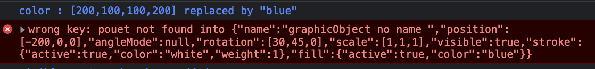
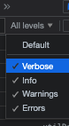

# Organizing properties with Literal Objects 
A **Literal object** can hold properties in a structured manner, avoiding to create many independant variables.( In sfotware architecture it is a *DataObject* )  
This is useful to exchange a bundle of properties in one shot.  
Literal objects are the bricks of this framework.   

  ### initialize an instance of any class with a Literal 
#### classical constructor 
Below is a classical way to declare properties of a Class. 
```javascript 
class MyClass{
constructor() {
      this.name= "some graphic", 
      this.visible= true, 
      this.stroke= { active: true, color: "white", weight: 1 };
      this.fill = { active: true, color: [200, 100, 100, 200] };
} 
} 
var myObject = new MyClass();
```
  All instance properties can be accessed with a dot notation or an array of keys notation : 
 ``` javascript 
 myObject.visible = false; 
 myObject["visible"] = false;
 myObject.stroke.color;
 myObject["stroke"]["color"] 
 ...
 ```  
 #### literal object 
 We can do exactly the same structure and the same access with a literal object: 
```javascript
 var myLiteral = {
      name: "some graphic", 
      visible: true,
      stroke: { active: true, color: "white", weight: 1 },
      fill: { active: true, color: [200, 100, 100, 200] },
    }
```

``` javascript
    myLiteral.visible = false; 
    myLiteral["visible"] = false;
    myLiteral.stroke.color;
    myLiteral["stroke"]["color"] 
```
### Initialize all properties of a class whith a literal in constructor
First, we cannot do *```this = myLiteral```* as we will try to destroy ourself.  
But **we can spell the literal recursively** and create new *key-values* in the current object.       
####  function extendProperties ( aLiteralToExtend, aLiteralOfNewKeyValue)   
This function extends a first Literal with the key-values of another. If a key was already defined, its value is replaced by the new one.    
In place of *aliteralToExtend* parameter, we can extend the current instance ```this``` :

##### external literal to initialize properties of a class 
```javascript 
class MyClass{
constructor(someLiteral) {
   extendProperties(this,someLiteral)
 }
}
// give a literal inline at instantiation time 
var myObject = new MyClass(
  {
      name: "some graphic", 
      visible: true,
      stroke: { active: true, color: "white", weight: 1 },
      fill: { active: true, color: [200, 100, 100, 200] },
    }
)
``` 
This works but stay weak as class definition is empty and can be filled by anything.   

#### A better way: set a default literal in the class definition   
It is better to have **the initial structure inside the constructor** :  
```javascript 
class myClass  {
  constructor(instanceProperties) {
    extendProperties(this,{
      name: "some graphic", 
      visible: true, 
      stroke: { active: true, color: "white", weight: 1 },
      fill: { active: true, color: [200, 100, 100, 200] },
    });
    // at this place, all default properties are set. Do we have some change ? 
    if (instanceProperties != null) patchProperties(this,instanceProperties);
  }
```  
With this code, any new object of the class will have automatically the default properties-values .  
``` javascript 
var myObject = new MyClass(); 
``` 
### give other values for a specific instance  
 we can provide more information to constructor for the instance to create with a literal : 
```javascript 
var myObject = new MyClass({
  stroke: {color:"blue"}
})
``` 
In order to respect the class definition internally defined, we use a modified utility function :  
#### function patchProperties (literalToPatch, patchToApply )
This will patch a literal with another literal in a controled way:    
You can change any values of the initial literal, but **cannot add new keys**.   
This mechanism allows to be sure **to respect the internal definition** of the class in the instances.   
In particular, this avoids typo errors in the *instanceProperties* literal.  

#### controls done by *patchProperties* 
In case of an **unknown key, an error is raised** and the patch stopped.   
If the key exists but the new value is not of the same kind of the existing (simple value , collection {...}, array [...], function, etc.)patch will **inform at the *verbose* level** of the console that the type has changed, as a reminder before problems arise.    
Below, a debug message : color was an array and is now a string,  
Later an error as the key 'pouet' is not in the class config:   
</img></img> 

### framework architecture 
All constructors in the framework classes will be on the same model :
- internally defined by an inline literal structure.  
- initialized by constructor with an instance literal to apply only controled changes.   
```javascript 
constructor(instanceProperties){
    extendProperties(this,
    {
      // some literal for default properties-values 
    });
    if (instanceProperties != null) patchProperties(this,instanceProperties);
}
```

# a class hierarchy to animate things 

 ## *BasicObject*
 **BasicObject** do quite nothing:  
It initialises a hierarchy with a single property *name*   
It defines two ancester methods to access properties of the class by their path givent as string  :  
```getData(someDotPath)```   Ex: getData("stroke.active")   
```setData(someDotPath, newValue)``` Ex: setData("stroke.color","blue")  
This will allow a scenario to catalog which data of an object will move over time :  
``` javascript
 parameter: {
  name : "fill.color",
  ...
  //At the due date, the scenario will call 
  targetObject.setData( parameter.name, newValue)
```   
  
 #### BasicObject full code 
``` javascript 
class BasicObject{
  constructor(instanceProperties) {
    extendProperties(this,{
      name: "BasicObject no name"
    });
    if (instanceProperties != null) patchProperties(this,instanceProperties);
  }
  // local relay to get or set values using dot path
  getData(someDotPath) {
    return getProperties(this, someDotPath);
  }
  setData(someDotPath, newValue) {
    setProperties(this, someDotPath, newValue);
  }
}
```   


### Mechanism of inheritance with literal properties
Sample with a extension of BasicObject :  
```javascript  
class MoveableObject extends BasicObject{

  constructor(instanceProperties) {
    super();
    extendProperties(this,
    {
      name: "moveableObject no name", // to facilitate debug, give a name to your objects
      position: [0, 0, 0], // current location of object to draw it
      angleMode: null,  // what's the unit of angle . If not set use current angleMode 
      rotation: [0, 0, 0], // current rotation of object. order is: rotateX, then Y , then Z
      scale: [1, 1, 1], // optional scale in the 3 directions
    });
    if (instanceProperties != null) patchProperties(this,instanceProperties);
  }
    ...
```

 
#### constructor sequence
A call to ***super()*** will initialize the object with the properties defined in the ancester.  
These properties are ***extended*** with the properties of literal defined in **this constructor**.    
Finally, the configuration is ***patched*** by the specific given for the new instance.   
*(Be aware to call super() without parameters)*

####  name reservation  in literal of class definition
If a property cannot have a default definition, don't omit to declare it to avoid later a unknown key error with instance patch..   
The good way is to have a *key with null* in the default properties and to change it with the  instance properties literal. 
```javascript 
  constructor(instanceProperties) {
    extendProperties(this,
    {
      model: null, // the shape to draw 
      texture: { active:false, image: null } // optional texture
    });
```  
You can see examples in the next chapter.   

#### more  
see source code in *util/utilProperties.js*