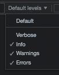

# Literal objects
 A literal object is a data structure using key-value pairs and curly braces in any combination.     
 This avoids to create discrete variables and simplify generic behaviours.    

 ## common ancester:  *BasicObject* with *config* 
 In the framework the holder of object's data is named **config**, short for *configuration*   
 This reserved word is defined as a literal in a common ancester named **BasicObject**.  
 **BasicObject** is a class that do nothing except implement the principles of propagation of configurations during inheritance through literals:   

 ### BasicObject 
``` javascript 
class BasicObject{
  static config ={
    name: "BasicObject no name"
  }
  // starting with a static definition, create a local set of literals properties
  constructor(instanceConfigVariant) {
    this.config = copyConfig(BasicObject.config);
    // apply variant if constructor was called with some parameters.
    if (instanceConfigVariant != null) this.patchConfig(instanceConfigVariant);
  }
... 
```
#### from static config to instance config
The framework uses *copyConfig* to share a unique structure in a static of class, structure which is duplicated into each new object to insure their independancy.  
Then this personal copy is patched with optional parameters given in constructor.   

#### **copyConfig** a literal to create a new one
```javascript 
// to get a deep copy, the simplest way is to serialize then deserialize the structure
function copyConfig(source) {
  var newConfig = JSON.parse(JSON.stringify(source));
  return newConfig;
}
```
 ##### literal JSON compatible for config in class definitions
 Despite a literal can hold any kind of value, including specific objects, stay in JSON compatible literals (ie with native js types) for the default values of a class in order to be copied easily.  
 When patching for an instance specificities, you can use any kind of literals.  

#### **patchConfig**: controlled patch of a literal by another literal.
You can change any values of the initial literal, but cannot add new keys. This mechanism allows to respect the static definition of the class in the instances by providing controls.

#### **extendConfig**: not controlled patch of a literal by another literal.
Same as previous, but new keys are allowed.  

### Inheritance sample : MoveableObject 
Let's see a first class in this framework hierarchy
```javascript  
// ------------------- sample object to move
class MoveableObject extends BasicObject{
  // Default config of this level
  static config = {
    name: "moveableObject no name", // to facilitate debug, give a name to your objects
    position: [0, 0, 0], // current location of object to draw it
    angleMode: null,  // what's the unit of angle . If not set use current angleMode 
    rotation: [0, 0, 0], // current rotation of object. order is: rotateX, then Y , then Z
    scale: [1, 1, 1], // optional scale in the 3 directions
  };

  constructor(instanceConfigVariant) {
    super();
    // add local default extension
    this.extendConfig(copyConfig(MoveableObject.config));
    // apply variant if called with
    if (instanceConfigVariant != null) this.patchConfig(instanceConfigVariant);
  }
  ...
```
First, the static config of the class will replace the key *name* with *"moveableObject no name"*,  
then new properties are added to the previous config in order to have properties for a moveable object. 

#### constructor 
A call to *super* will initialize *this.config* with the configuration of the ancester.  
This configuration is *extended* with a copy of the static configuration of this level.    
Finally, the configuration is *patched* by the specific of the new instance .

##### simplify constructors
Using a literal config this way allows to have default values for any property of a class.   
You can create an object with all defaults by calling an empty constructor:      
``` obj_1 = new GraphicObject()```  
Or you can give any part of the config to change values :    
``` obj_3 = new GraphicObject( { name: "my bowl", position: [0,-200,0]});```  
  

#### controls done by *patch*    
*patchConfig* controls that the optional config given in constructor match keys in class definition.   
This avoids in particular typo errors.   
That's why some key in static are defined with *null* : it is a kind of key reservation.   
*patchConfig* also check that an updated key has a new value of same kind (simple value , collection {...}, array [...], function, etc.) .If not, it informs at the *verbose* level of the console that the type has changed, as a reminder before problems arise.   
Below, a debug message as color was an array and is now a string, and an error as the key 'pouet' is not in the class config:   
</img></img> 
    

## accessing data in a literal 
In code, any data of literal can be get or set with either a dot notation or an array notation : 
``` javascript 
 obj_1.config.fill.color = 'yellow'
 obj_1.config["fill"]["color"]= 'orange' 
 obj_2.config.stroke.active = false; 
 obj_2.config["stroke"]["active"] = true;
 console.log(obj_2.config);
```
### interpreted values
In order to be able to pick any data by its name without creating so many specific methods, the framework introduces two methods (defined in class ancester) with a textual dot notation: 
- getData (path)
- setData (path, value)

Data names are extracted from *object.config* 

``` javascript    
obj_1.setData("fill.color","yellow");
obj_1.setData("position[0]",120);
obj_2.setData("position",[120,0,200]);
if (obj_2.getData("stroke.active")== false) 
...etc. 
```
This kind of notation is used to act on the values of an object during a generic **scenario**.    
(for dev: someCall(*fill.color*) will result in receiving a value, while someCall(*"fill.color"*) will result in a string path to later get and set *fill.color*  ) 

#### more  
see source code in *util/utilConfig.js*