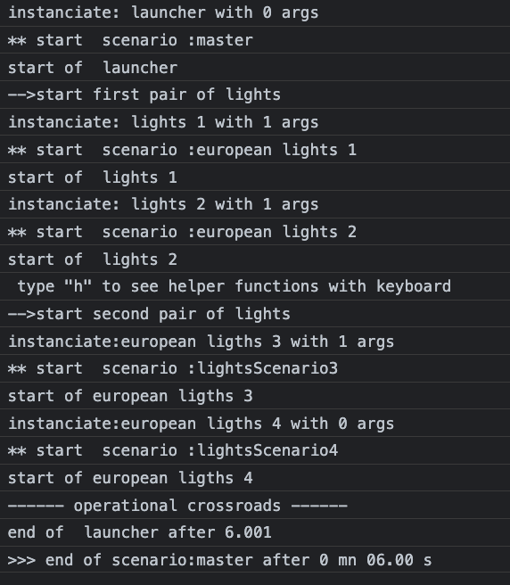

# Scenarios 
A *scenario* takes care of timing & scheduling to start, stop or wait for parts of your code.   
(Samples are coded as p5.js sketches, but scenario can be used in any js environment. )   

## scenario 
A **scenario** plays a **script**, or a series of **scripts**.    
Once a script is finished, the scenario runs the next one.    
### script vs  generator

A **generator** is a special function characterized by a declaration with a star : ```myFunction*```    
When this function is called directly:  ```myFunction()```, it **instantiates** an object, a kind of class holding the source code and internal variables.  
=>a **script** in the framework holds the generator's function and an *instance* of this *generator*   

To execute the code of an instance of generator, one must call its method **next()**.   
The code advances up to a **yield** instruction or up to its end and returns to caller.    
To continue, caller must call again *next()*

We call a **step** a part of generator's code that run without being interrupted   
*beginning*-----step 0-----**yield**--step 1---**yield**--- etc---**yield**--- last step ---*end*

## how a scenario interacts with the underlaying generators
When a scenario starts, it get the first *generator* of its list and creates an instance.   
Once started, scenario call the generator to run a *next step* through its *advance* method.    
The generator executes the step then returns either by : 
- **yield** -> The scenario will wait the default *interval_ms*, a property of the scenario, before calling for the next step.
- **yield** xxxxx   -> The scenario will wait the number xxxxx of ms before calling for the next step.  
- a **return** instruction  -> The scenario will stop this script . 
- the *end* of generator's code.    -> Same as above. 
    
When the script returns to the scenario *advance* method, **this method push itself in the js event loop to be restarted  later**:    
 ``` javascript 
   advance() {
    var step = this.script.instance.next();
    if (!step.done) {
      var nextEcheance =
        step.value == undefined ? this.interval_ms : step.value;
      // postpone its job , but wants to be recalled with the scenario context
      this.timeoutId = setTimeout(this.advance.bind(this), nextEcheance);
    } else {
      this.stopScript();
    }
  }
 ```  
This code loops until the end of the script, step by step.    
**Notice the *.bind(this)* to relate the future with the current scenario.**  
## how it stops 
A script stops when the end of its code is reached or when its scenario is stopped.   
A scenario can be stopped at any time with the method ```scenario.stop()```    
A scenario ends naturally when the last script of its array of scripts is ended.   
## miscellaneous about scenarios 
- Once a scenario is ended, one can restart it from beginning by **myScenario.restart()**.  
=> *start* or *restart* will create a fresh instance of the generator allowing to reuse it several times.     
- Several scenarios can be started and can run in parallel with their own scheduling.  
- The code inside a generator can start or stop another scenario.     
- If useful, a scenario can wait the end of another in a script by pooling its status regularly:   
```while (!theOther.isEnded) yield 100```

# Simple example : a p5 sketch traffic_lights  
The goal is to enlight a (european) traffic lights with defined durations  
</img>   
## TrafficLight class
A class to hold infos as a literal object *config*.   

``` javascript  
class TrafficLight {
  constructor(name) {
    this.config = {
      name: name,
      visible: true,  // drawn or not 
      active: false, // lights stay all grey
      lights: {
        green: { active: false, colors: { on: "#3ADF00", off: "#243B0B" }, duration_ms: 3000 },
        orange: { active: false, colors: { on: "#FFBF00", off: "#61380B" }, duration_ms: 1000 },
        red: { active: false, colors: { on: "#FF0000", off: "#3B0B0B" }, duration_ms: 4000 },
      },
    };
  }
  
  draw() {
    if (!this.config.visible) return;
    ... do the job
 }
  ```   
### script to animate lights and scenario to run the script
First, be aware of the special notation ```function*``` which means this is a *generator* not a simple function.     
Each yield can return a number of <u>milliseconds</u> to wait before coming back.   
As we want a full time animation, the script has an infinite loop inside ```while(true)```    
function *patchProperties* changes only the keys given as variants. *(see chap1-literals)*

``` javascript 
function* europeanScript(oneTrafficLight) {
 // activate the traffic light box
 oneTrafficLight.config.active = true;
 let lights = oneTrafficLight.config.lights;// local relay for readability
 while (true) {
   //-------- set red and wait
   patchProperties(lights, {green: {active: false }, orange: {active: false }, red: {active: true },});
   yield lights.red.duration_ms;
   //---------- set green and wait
   patchProperties(lights, {
     green: {active: true },orange: {active: false },red: {active: false },});
   yield lights.green.duration_ms;
   //---------- set orange and wait 
   patchProperties(lights, {
     green: {active: false },orange: {active: true },red: {active: false },});
   yield lights.orange.duration_ms;
 } // infinite loop 
}
```
## create the scenario  
### Scenario class 
The constructor of a scenario has two parameters:  
- specific properties  
- an array of generators ( list of scripts to be created ).    

```javascript 
  constructor(instanceProperties, generatorsToUse = []) {
    extendProperties(this,
      {
        scenarioName: "Scenario noname",
        interval_ms: 60, //ms of wait if yield don't return a specific value
        trace: false,
      } 
    // first parameter : optional changes on default properties
    if (instanceProperties != null) patchProperties(this,instanceProperties);
    // second parameter
    this.generatorsToUse = generatorsToUse; // its an array of scripts
    // but if just one : accept and make it an array
    if (!(this.generatorsToUse instanceof Array))
      this.generatorsToUse = [this.generatorsToUse];
  ```  
  ### scenario instance 
  When creating an instance, one can give all or part of properties :   
   ``` javascript   
 let europeanScenario1 = new Scenario(
    { scenarioName: "european lights 1", trace: true },
    [  // array of scripts for this scenario . Here just one 
      { scriptName: " lights 1", generator: europeanScript, arguments: [traffic_1] });
    ]
```
### Array of scripts   
To have a generic scenario , the generators are described in two separated entries : 
- the generator: only the **function name**  DON'T PUT ANY PARENTHESIS AFTER : *europeanScript*   
- an optional array of argument's values (if any).  
  Our has one : *arguments: [traffic_1]*    

This way allows to keep an agnostic scenario engine with any kind of generators, with or without any kind of parameters.   
The generators can be reused several times are they are instantiated *inside* the scenario in *start* or *restart*.   

## external scenario vs scenario internal to the class 
In the sketch example, we draw 4 traffic lights.    
The first traffic_light is animated by the scenario seen above: *europeanScenario1*.  
The second one has a similar scenario using the same generator but with other properties: 
```javascript
 europeanScenario2 = new Scenario(
    { scenarioName: "european lights 2", trace: true },
    { scriptName: " lights 2", generator: europeanScript, arguments: [traffic_2] });
  ```   
Any scenario can be established this way. 
### for example : create a scenario internal to a class 
When thinkink about, the blinking red-green-orange is a dedicated traffic light behavior.    
It can be a better idea to make the scenario and the script part of the *TrafficLights class*.   
We will do that and explore two slighty different ways, one for *traffic_3* , another for *traffic_4*:    

### generator as a class method 
For traffic_3 we use an exact copy of the previous *europeanScript* except the declaration:   
As a method we omit the *function* keyword but keep the **star** to indicate a generator : 
``` javascript 
    *internalEuropeanScript(oneTrafficLight) { 
      ...
    }
  ```   
The scenario is created in the constructor of TrafficLight for this case.   
The arguments' list of generator now reference **this** : 
```javascript
    this.lightsScenario = new Scenario(
      { scenarioName: "lightsScenario3", trace: true },
      { scriptName: "european ligths 3", generator: this.internalEuropeanScript, arguments:[this]}
    );
```   
*lightsScenario* is part of class and can be started for our instance by: 
``` javascript   
traffic_3.lightsScenario.start(); 
```   

### traffic_4 variant : an internal generator *without parameter*

The idea is : "why still using a parameter as we know we are already in the object ?"  
We define a modified generator script *_internalEuropeanScript_()*, without parameter.  
Inside code of generator, previous references to parameter *oneTrafficLight*, are now replaced by *this*:   
```javascript    
  * _internalEuropeanScript_() {
        this.config.active = true; // was oneTrafficLight.config.active = true;
        etc .// all oneTrafficLight replaced by this 
```   

The scenario is created in the constructor for demo purposes : 
```javascript 
      this.lightsScenarioBis = new Scenario(
        { scenarioName: "lightsScenario4", trace: true },
        { scriptName: "european ligths 4", generator: this._internalEuropeanScript_.bind(this)}
      );
```  
Notice that there is no more *arguments* entry in literal as this generator has no parameter.   

*lightsScenarioBis* is part of the class and can be started for our instance by: 
``` javascript   
traffic_4.lightsScenarioBis.start()
```  
#### Tips: .bind (this)
 **a generator is detached of the context** ( as will be any anonymous function).    
Without indication, *this* is not known inside the generator.  
Binding the function with *this* allows to use *this* inside the script.   


# Now the results 
## using p5 to draw in 3D 
In the main prog, in the *setup* function of P5, we create the lights, all with default properties except the name.  
We create also the two external scenarios to animate 1 and 2.( for 3 and 4 already we will use the internal scenario examples.)        
Later, in the *draw* method, we ask the traffic lights to draw themselves at a given position.   

``` javascript 
function setup() {
  canvas = createCanvas(800, 800, WEBGL);
  canvas.position(0, 0);
  cam = createCamera();
  cam.move(0, -200, 0);

  traffic_1 = new TrafficLight("pole 1");
  traffic_2 = new TrafficLight("pole 2");
  traffic_3 = new TrafficLight("pole 3");
  traffic_4 = new TrafficLight("pole 4");
  // external scenarios
  europeanScenario1 = new Scenario(
    { scenarioName: "european lights 1", trace: true },
    {
      scriptName: " lights 1",
      generator: europeanScript,
      arguments: [traffic_1],
    }
  );
  europeanScenario2 = new Scenario(
    { scenarioName: "european lights 2", trace: true },
    {
      scriptName: " lights 2",
      generator: europeanScript,
      arguments: [traffic_2],
    }
  );
  ...
}

function draw() {
  orbitControl(1, 1, 1);
  background(60);
  //(positionning and rotation omitted below. See code)
     traffic_1.draw();
     traffic_2.draw();
     traffic_3.draw();
     traffic_4.draw();
}
```   
### starting the lights  
If we start the lights'scenarios directly, this will work for each one, but they will not be synchronized.   
We need a launcher to start in time the pairs of lights : another scenario .    
This master scenario is also **created and started** in setup : 
```javascript 
function setup() {
  ....
  // a general scenario to  synchonized the both sides of the road
  masterScenario = new Scenario(
    { scenarioName: "master", trace: true },
    { scriptName: " launcher", generator: launchScript }
  );
  // start all vi master
  masterScenario.start();
}
``` 

#### master scenario script 
First we set all lights to red using a literal as a multi parameters configuration: 
```javascript 
function* launchScript() {
  // set all to red 
  var onlyRed = { active: true, lights:{ green: { active: false }, orange: { active: false }, red: { active: true }}};
  patchProperties(traffic_1,onlyRed );
  patchProperties(traffic_2,onlyRed );
  patchProperties(traffic_3,onlyRed );
  patchProperties(traffic_4,onlyRed );
  ...
  ```
Then we start the scenarios of the first pair of lights :
```javascript 
  // start first pair on red
  console.log('-->start first pair of lights')
  europeanScenario1.start();
  europeanScenario2.start();
  ...
  ``` 
Time is now running for these two scenarios.   
We wait a bit before launching the other pair in order to be synchronized : 
```javascript 
... 
// red is 7s, green 4s and orange 1s. 
//To have both red overlapped 1s wait 6s before stating second pair:
// 123456712341
// ......123456712341
  yield 6000;
  console.log('-->start second pair of lights')
  traffic_3.lightsScenario.start();
  traffic_4.lightsScenarioBis.start();
  console.log('------ operational crossroads ------ ')
}
```
The master scenario will end but the others are running:   
Traffic lights are synchronized and run for ever   
</img>

### stop the scenarios
Lights scenarios run for ever as they have an infinite loop in their scripts.  
We can check a scenario's status with two properties:
-  **isStarted**
-  **isEnded** 
  
In the code example, we stop brutally all lights after 60s (if not yet stopped) :

```javascript 
  // the scenarios run for ever. 
  // We stop all after 60s to conclude this tuto
  if (!europeanScenario1.isEnded) { // avoid to redo once terminated
    if (millis() > 60000) {
      console.log("------ general stop ------")
      europeanScenario1.stop(); // stop scenario
      traffic_1.active = false; // turn off the lights
      europeanScenario2.stop();
      traffic_2.active = false;
      traffic_3.lightsScenario.stop();
      traffic_3.active = false;
      traffic_4.lightsScenarioBis.stop();
      traffic_4.active = false;
    }
  }
```
####  scenario.startGlobalMs
In the code above, we have used ```millis()```which is the elapsed time since **the sketch** is running.   
We could have used the exact elapsed time since **the scenario** was started :   
```if( millis() - europeanScenario1.startGlobalMs > 60000 )  ```     

#### trace of scenarios  
As we start scenarios with *{trace: true}* , we can follow the story on the console:    
</img>


# summary 
A *scenario* cooperates with a *generator* to advance code automatically under a controlled schedule.  
A generator can execute any js code in its current context (whole app, object instance,..) or through its own function parameters. 
### next chapter : a shared generator  *scriptJourney*   
We design a generator to automatically change the value of a property in time, according to a trajectory.   
This can be used for ***any property of any kind of object***, as long as the property is calculable ( simple numeric value or array of numeric values )    
See **chap3-basicMovement.md** 


  


