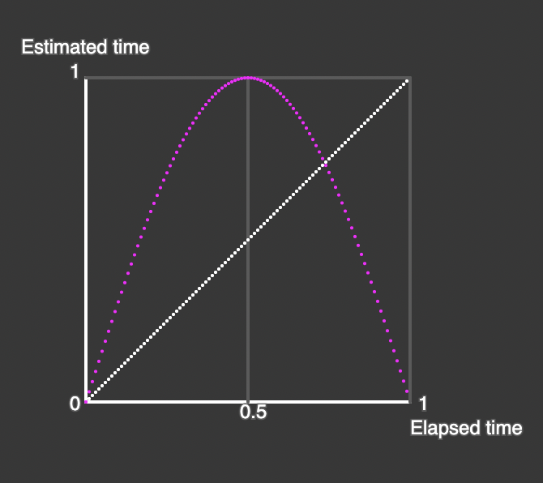
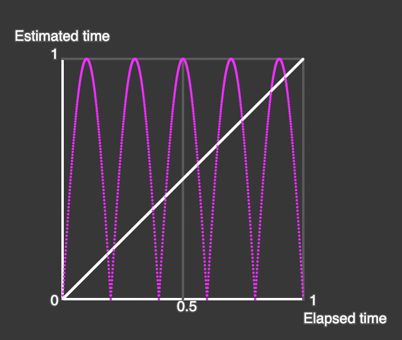

# Advanced animation

## speed variation for smoother movements 

### elapsed time vs estimated time 

The *scriptJourney* interpolates values based on *elapsed time* in order to be at *end* after the defined duration.  
This time *t* is calculated as a linear fraction between 0 and 1 : *elapsed time / duration*  
and this proportion is applied to the distance to travel *(end - start)* to calculate exact new position. 

### give to journey an estimated time different of the elapsed time 

Let see the following plottings:   
   
The white diagonal is the default linear function : **estimated time = elapsed time** :  **(t) => t**  
Estimated time is the time used to calculate the ratio of the position along the trajectory.    
The green curves are obtained with the following functions (from left to right: power of 2,3,4):    
(t)=> t * t   
(t)=> t * t * t   
(t)=> t * t * t * t   
The red ones are the symetrical functions :   
(t)=> 1-(1-t) * (1-t)   
(t)=> 1-(1-t) * (1-t) * (1-t)   
(t)=> 1-(1-t) * (1-t) * (1-t) * (1-t)   
All these functions allways stay between 0 and 1.   
These one starts all at 0 and end at 1.   
Any function staying between 0 and 1 can be used for other funny effects.    

## what are the effects ? 

Look at the 0.5 vertical line when half time is elapsed :  
For standard, estimated = elapsed : at half time, half the distance.    
For the green curves, the estimated time is below, not yet at the half:   
=> **The green curves start slowly and accelerate at the end**  
For the red curves, the estimated time is greater than the elapsed.   
=> **The red curves start quickly and slow down at the end**   
For green or red functions : => **More the power, more the speed difference.**   
For animation, these kinds of variations give more elegant transitions than the basic one. 
## easingOnT function 
The framework uses a reserved name ```easingOnT``` which is checked by the journey script for an optional calculation of estimated time.
### how to set a time variation in a journey's parameter configuration 
You can give directly an anonymous function in the literal defining a journey or use an already defined function.   
**Remember this is a function not a function call.**    
 
```javascript   
    {
      name: "position", // the parameter involved in the journey
      start: [0, 100, 0], // the start value of parameter. Optional.
      end: [-50, -200, -600], // the destination value of parameter
      easingOnT: (t)=>t*t*t   // can define specific function in line . up to you. 
    },
    {
      name: "rotation", // the parameter involved in the journey
      end: [150, 230, 0], // the destination value of parameter
      easingOnT: easingOnT_flip_t2  // this one is predefined in the scriptJourney source code 
    },
```
The following function names are predefined in *scriptJourney.js* code to facilitate reuse : 
```javascript 
  function easingOnT_t2(t) {return t*t};
  function easingOnT_t3(t) {return t*t*t};
  function easingOnT_t4(t) {return t*t*t*t};

  function easingOnT_flip_t2(t) { var flip = 1-t; return 1 - flip*flip};
  function easingOnT_flip_t3(t) {var flip = 1-t; return 1 - flip*flip*flip};
  function easingOnT_flip_t4(t) {var flip = 1-t; return 1 - flip*flip*flip*flip};
  ```
#### more funny effects 

##### back in the middle of the trip

(supposed your default anglemode is ```angleMode(DEGREES)``` )   
You can try the function ```(t)=> sin(t*180)``` :  
      
As the estimated time is used to calculate the distance from start, using this function will reach the end in half time then go back to origin in the second half of time.

##### way back trajectory 

if you have defined a trajectory from start to end with your function time **f(t)** going from 0 to 1,  
you can define the exact way back using  **1-f(t)** . The interpolation will go from end(1) to start(0).       

##### amazing trajectory 

As the rotation is applied to the vertical y in the example journey with dragon, it can do *No No No No No* with head by   
``` easingOnT:  (t) =>  abs(sin(t*180*5)) ``` for the rotation parameter (here degrees).    
  

### sample 

the sketch in *advanceMovement* is the same as the sketch in *basicMovement*, except the use of function on time *easingOnT*.You can observe some subtiles differences.   
