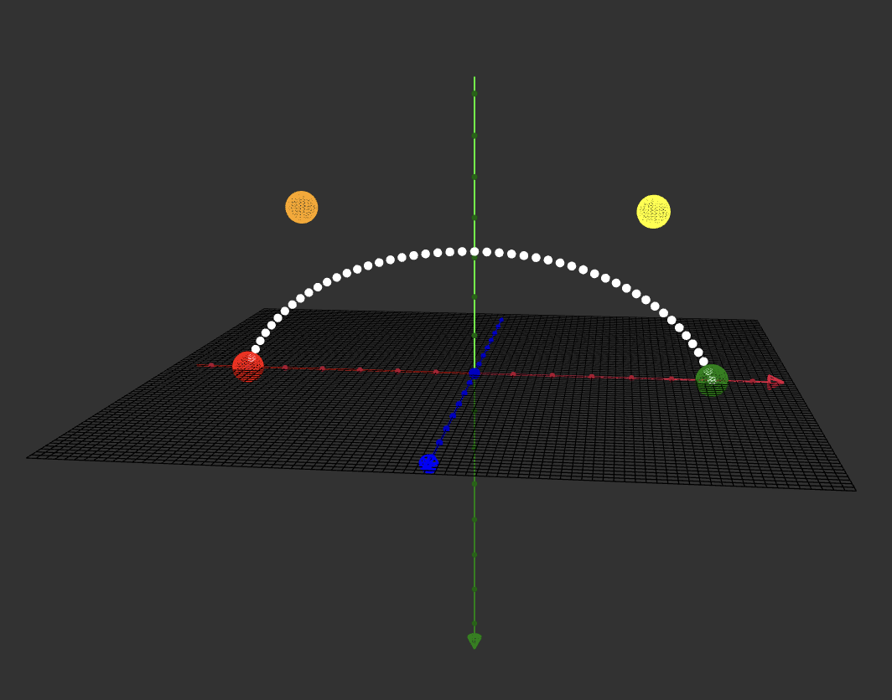
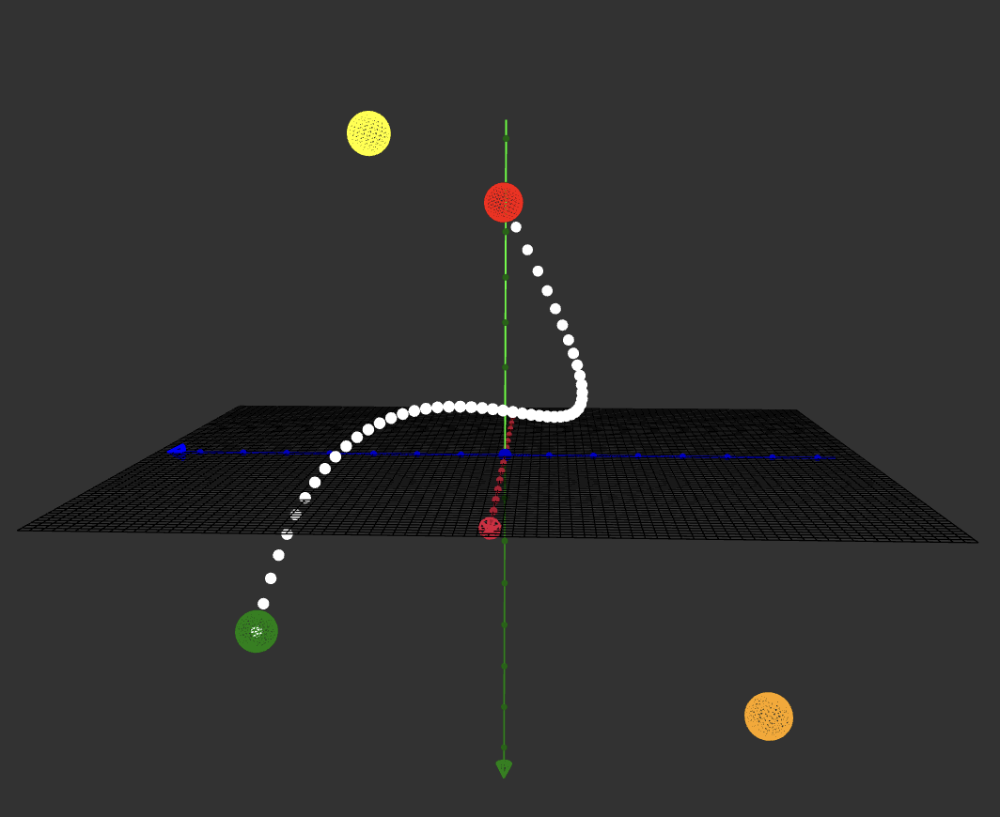
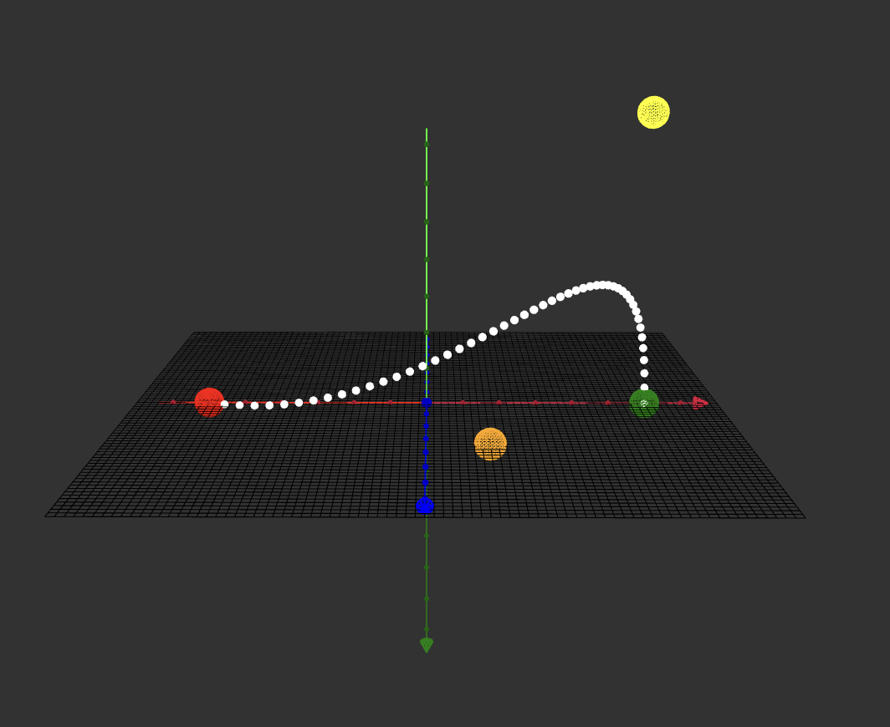
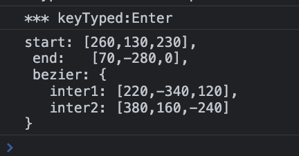
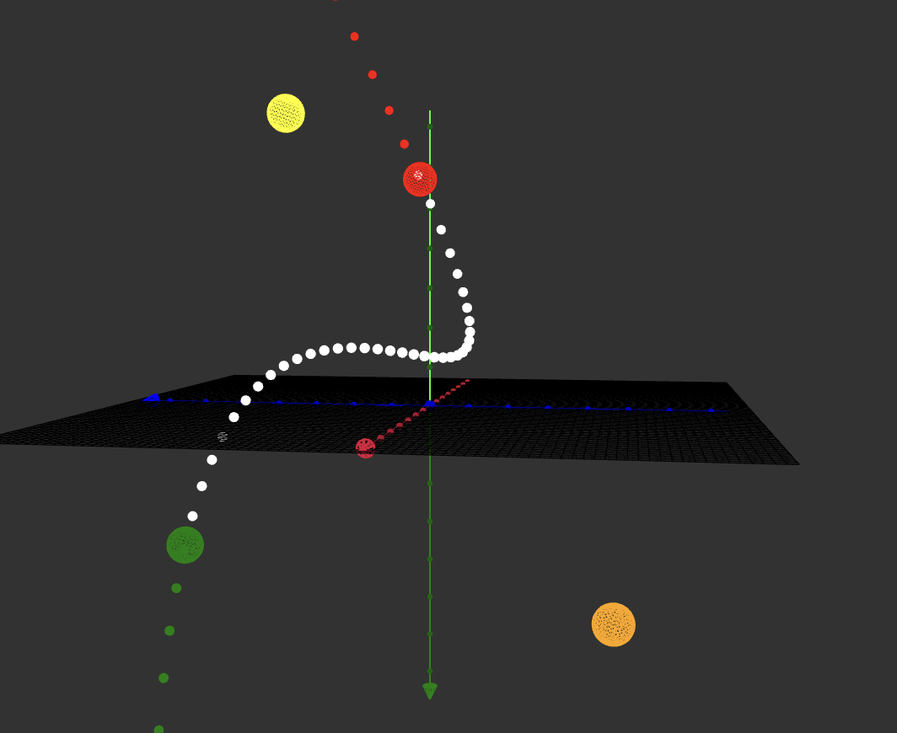
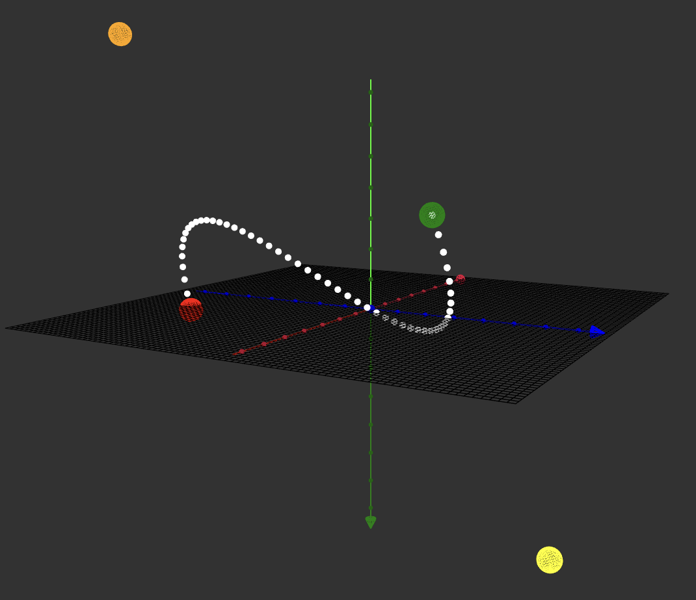
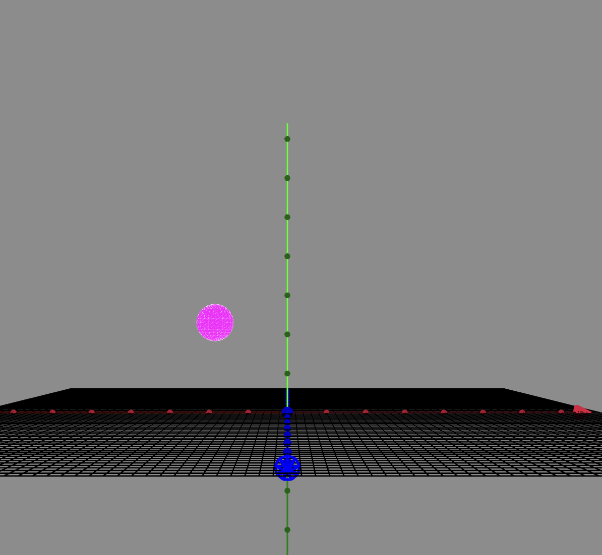
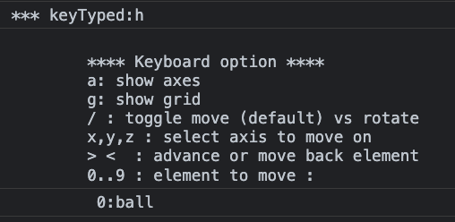

#  More advanced animations 
# beziers curve 
We will use quadratic bezier curves (see wikipedia) to design a trajectory from a start point to an end point.  
Two anchors can be set to pull up the default linear rope.   
## bezier quadratic parameters : 2 x 2 coordinates 
```javascript 
 {
  start: [300, 0, 0],
  end: [-300, 0, 0],
  bezier: {
    inter1: [220, -210, 0],
    inter2: [-220, -210, 0],
  }
};
```
### bezier helper 
The sketch in *bezierHelper* source code can show any Bezier curve.  
The trajectory designed by the above configuration is the following:   
 </img>   
start point is **green**, end point is **red**, inter1 is **yellow** and inter2 is **orange**    

---
Other configurations with same start and end:
``` javascript 
bezier: {
  inter1: [220,-650,0] 
  inter2: [-220,-660,0] 
}
```   
 </img>   
---
```javascript 
 bezier: {
   inter1: [220,-430,-30] 
   inter2: [-250,430,30] 
}
```
 </img> 
---

### bezier is a 3D curve 
With the helper and the *orbitcontrol* of p5, you can see the curve from any point of view and design a 3D travel: 
```javascript 
{
 start: [260,130,230], 
 end:   [70,-280,0], 
 bezier: {
   inter1: [220,-340,120] 
   inter2: [380,160,-240] 
 }
}
```
 </img> 

## how to design a Bezier curve 
The simplest manner is to use the sketch of BezierHelper :  
-> fill in the conf literals with start and end you want to travel at the beginning of code :  
```javascript 
 // future config part of a bezier in a journey 
 var conf = {
  start: [220,-280,320], 
  end:   [-270,-150,110], 
  bezier: {
    inter1: [200,-250,300], 
    inter2: [-250,-150,150] 
 }
};
```

-> If no idea , give *inter1* and *inter2* values close to  *start* and *end*.   
### keyboard helper 
In the draw function of the sketch, you can see a call to ```  kbHelp();```  
This allows to use keyboard to move elements on the canvas:  
 
--> key x, y or z to choose an axis to move on  
--> key 0, 1, 2 or 3 to choose an element to move : 0-start point, 1-end point, 2-inter1 , 3-inter2   
--> key  > to advance on the choosen axis   
--> key < to move back on the choosen axis   
--> key *enter* to see on the console the new coordinates   
( be aware to strike lowercase keys when focus is onto the canvas )  
  
  </img>   </img>  

 You can copy/paste this text from the console to your source code to mark the job for next time.    
 You can copy/paste this text from the console to the source of your journey parameters.    
 ##### more info in source code of utilKeyboard.js 
 
 ### using a Bezier conf in a journey configuration 
 You just have to add the coordinates of the two Bezier points into the action of a journey.  
 If you have designed trajectory with the Bezier sketch, you can copy(from console)/paste(to your journey code)    
 ```javascript 
 parameters: [
    {
      name: "position", 
      start: [260,130,230], 
      end:   [70,-280,0], 
      bezier: {
          inter1: [220,-340,120] 
          inter2: [380,160,-240] 
      }
}
``` 
When framewok encounters a Bezier part, it will replace the default linear interpolation of value by the Bezier curve.     
( You can also apply any *easingOnT* function to vary the speed along this non linear trajectory )

#### Any type of parameter can change along a bezier trajectory    
Bezier route can be used for any parameter of any component, not only to move or rotate.    

### Tip effect:  using Bezier out of range   
Maths precise that the curve is only valid in the range 0..1, but what happens if you go outside ?     
In the following, we draw a bezier from -0.2 to 1.2 : ( <0 in green, >1 in red )    
  </img>   
One can see that the curve accelerates and prolongates the trajectory in an asymptotic way and large acceleration.   
This can be used to make special effects:  
You can give a special *easingOnT* function that goes outside 0..1.   
The above function is: ```easingOnT: (t)=> -0.2+ (1.4*t)```  
In such a case, the element will not go from start to end but from a place far under start (at -0.2) and terminate far after normal end (at 1.2). A manner to have an escape effect.     

#### View in action 
The sketch *6-bezierTrajectory* shows the following :   
A travel curve is factorized in order to be reused several times  : 
``` javascript 
var travel = {
  name: "position",
  start: [250, -160, -60],
  end: [-220, 10, -290],
  bezier: {
    inter1: [-190, 370, 240],
    inter2: [-50, -460, -480],
  },
};
``` 
</img> 

The sketch define 4 reuses for demonstration :    
- the outward journey uses implicit f(t) = t to go from start to end on the white route. 
```javascript 
var travel1 = copyProperties(travel);
var outWardJourney = { duration_ms: 10000, parameters: [travel1]};
```
- the return journey uses  ```f(t) = 1-t``` to go backward, from end to start on the white route
```javascript 
var travel2 = copyProperties(travel);
travel2.easingOnT= (t) => 1 - t;
var returnJourney = { duration_ms: 10000, parameters: [travel2]}
```
- Then the same trip coming and going far away by overriding the 0..1 limits of Bezier definition 
```javascript 
// reuse position movement and use beziers out of range 0..1 from -0.2 to 1.2  
var travelSpecial1 = copyProperties(travel);
travelSpecial1.easingOnT = (t) => -0.2 + (1.2+0.2) * t;
```
- Same as above but travel back by 1- f(t)   
```javascript 
var travelSpecial2 = copyProperties(travel);
travelSpecial2.easingOnT = (t) => 1 - (-0.2 + 1.4 * t);
```
</img>

For pleasure, it will inflate the baloon at destination before going back and add some variation of colors and size.   
##### more 
Using *kbHelp()* in the draw loop, you can show/hide the debug grid(g) or the axis(a) like above.  

</img>


  