# camera movements 
Another use of journeys and literals is moving the camera.    
As camera is already a component of p5, we define a class **Tripod** to hold cameras. 
## Tripod4Camera class 
A tripod is a component localized in space like any other *MoveableObject* with some specific methods  and a *setData* overwritten : 

```javascript 

class Tripod4Camera extends MoveAbleObject {
  // specific for this level
  static config = {
    position: [0,0,700],   // replace the default [0,0,0] to see something if not updated
    lookAt:   [0, 0, 0],     // new property 
  };
 
  /*  mounting a camera on a tripod will give the camera the tripod position  */
  mountCamera(someCamera) { ... } 

  /*  mounting a tripod under a camera will give the tripod the current camera values */
  mountUnderCamera(someCamera) {... } 

/*
  refreshCameraPosition: propagate the tripod position to the real camera . 
  If code change tripod position values, this new coordinates must be propagated to the p5 camera 
*/
  refreshCameraPosition() {... } 

  /*
    setData is overwritten to propagate changes automatically 
  */
  setData(somePath, newValue) {
    setProperties(this.config, somePath, newValue);
    this.refreshCameraPosition();
  }
}
```

### sample 
The sketch **cameraLiberty** uses several tripods:  
First, a belt of 6 tripods is set up around  Liberty :      
```javascript 
function createTripods(){
 var angle = 0; 
 var distance = 300;
 while (angle <360){
  var x = 2*distance * sin(angle) ; 
  var z = 2*distance * cos (angle);
  var y = 0; 
  var tripod = Tripod4Camera(
    { name:'at '+angle,
      position:[x,y,z],
      lookAt:[0,0,0]
  })
  beltOfTripods.push(tripod);
 angle+=60;
 }
}
```
A scenario and a generator animate the story by jumping from a tripod to another.   
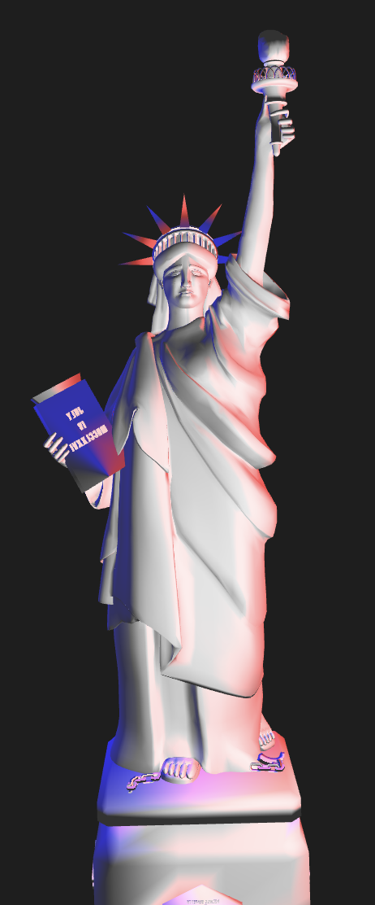</img>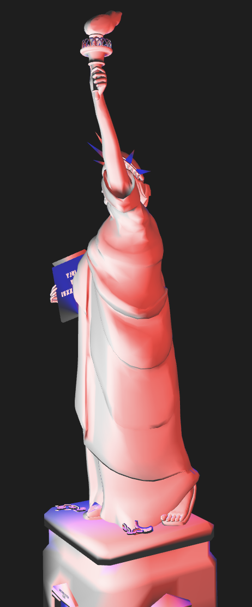</img></img></img> 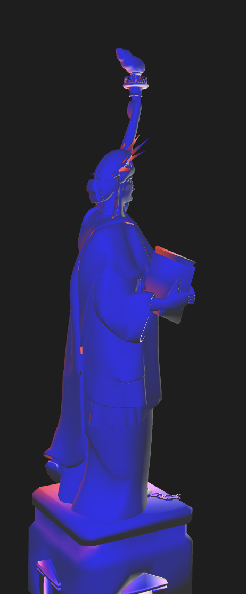</img>  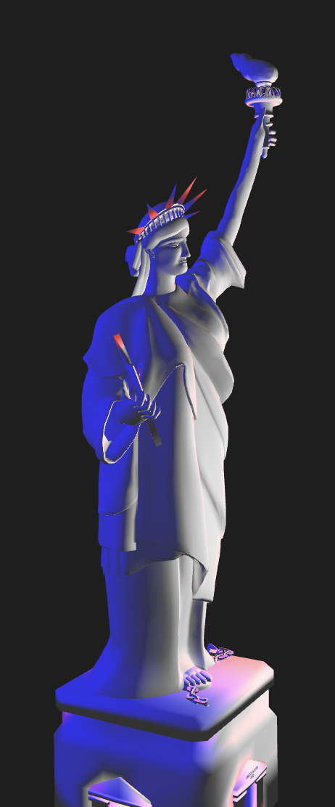</img>   
At the end of each tour, the tripods climb a bit (-200 on y axis ) to change their points of view.   
**The generator** : 

```javascript 
function * jumpTripod(aCam, maxTurns){
  let index = 0;
  let turns = 0 ; 
  while (turns<maxTurns){
    console.log("Camera on tripod "+index)
    beltOfTripods[index].mountCamera(aCam);
    yield 3000
    beltOfTripods[index].movePosition([0,-200,0])
    index+=1;
    if( index==beltOfTripods.length) {
      index = 0;
      turns+=1;
    }
  } // while 
}
```   
As one can see, this generator has to parameters, which camera and number of turns.   
**The scenario** to run this script must give these parameters as *arguments* :   

```javascript  
scenarioTurnAround = new Scenario(
  { scenarioName: "turn around Liberty", trace: true},
  [
    { scriptName: "jump on tripods", generator: jumpTripod, arguments:[camera1, 3 ]},
  ])
}
```  
Just have to start it : ```  scenarioTurnAround.start(); ```  
### so what ? 
For now, using Tripod4Camera is not a big step up from the native camera capabilities in p5.   
##### move camera with keyboard  
As a first tip, a tripod is a *moveableObject* so it can be moved with the keyboard helper functionalities. You can search a good point of view by moving it around.   
How to do:   
Add the keyboard helper in your draw loop.   
```
function draw() {
  orbitControl(1, 1, 1);
  kbHelp();
```
Give a place to your tripod(s) in the list of moveable elements by keyboard : 
( put this in your setup ) 
``` kb.objectsToMove.push(initialTripod); // slot 0 if first pushed```     
Key 0 will select this tripod.   
Another way is to use console *repl* and type at the console prompt: ```kb.toMove = initialTripod```
   
Using the keys x,y,z, <, > , you can move the tripod to find a good place and strike key "enter" to get values :    
</img> 
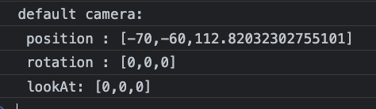</img> 

## a journey for a tripod holding the camera 
But the better for using a tripod holding a camera is to use the journey framework to move along any travel, from linear to beziers curves.  
### sample 

First (with the help of *6.1-bezierHelper*) we design a curve and pick the values in console: 
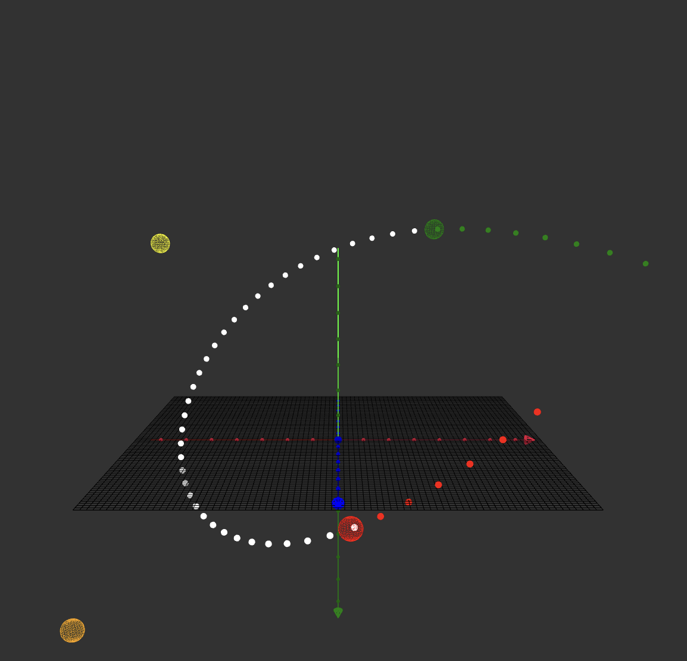
</img>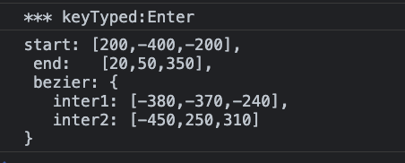   
Then define a journey (for any moveable object) with these values:  

```javascript 
let journeyTripod ={
  duration_ms: 20000,
  parameters: [
    {
      name: "position", 
      start: [200,-400,-200], 
      end:   [20,50,350], 
      bezier: {
        inter1: [-380,-370,-240], 
        inter2: [-450,250,310] 
      },
    }]
}
```
Then create a scenario and associate a tripod to this journey :  

```javascript 
scenarioMoveUpDown = new Scenario({ scenarioName: " tripod journey ", trace: true},
  { scriptName: "up to down",generator: scriptJourney, arguments: [journeyTripod, movingTripod] })
// tip: if only one script, can omit the [] around
}
``` 
Before starting the scenario, don't forget to mount the camera that films on the tripod:
```javascript
  movingTripod.mountCamera(camera1);
  scenarioMoveUpDown.start();
  ```
Here images at beginning and at the end of the tripod bezier journey.

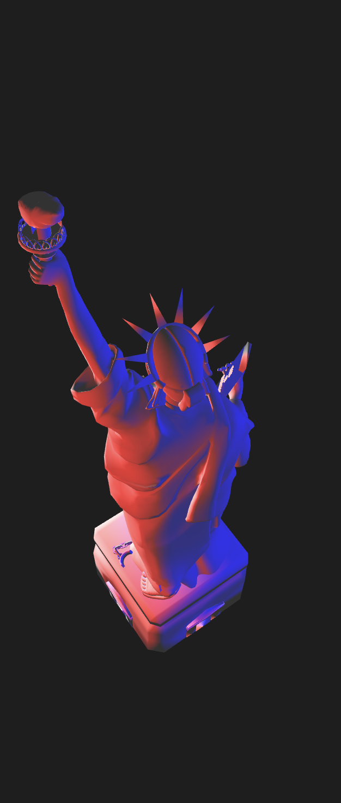   
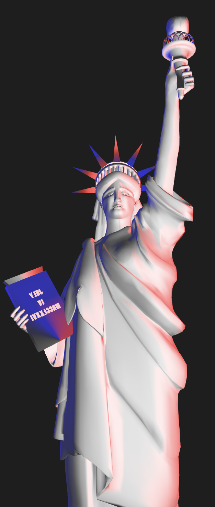    

At the end, the script put the *debugTripod* under the camera, ie it takes the last known values and point of view doesn't change.   
``` javascript 
 console.log(' set camera on debugTripod for keyboard movements') 
   // once all done, set debugTripod at the last position 
 debugTripod.mountUnderCamera(camera1)
``` 
#### tips:  using keyboard keys 
As *debugTripod* have been set in the kb stack ```kb.objectsToMove.push(debugTripod);``` , 
we can continue to move the camera with keys and explore possibilities. 
 
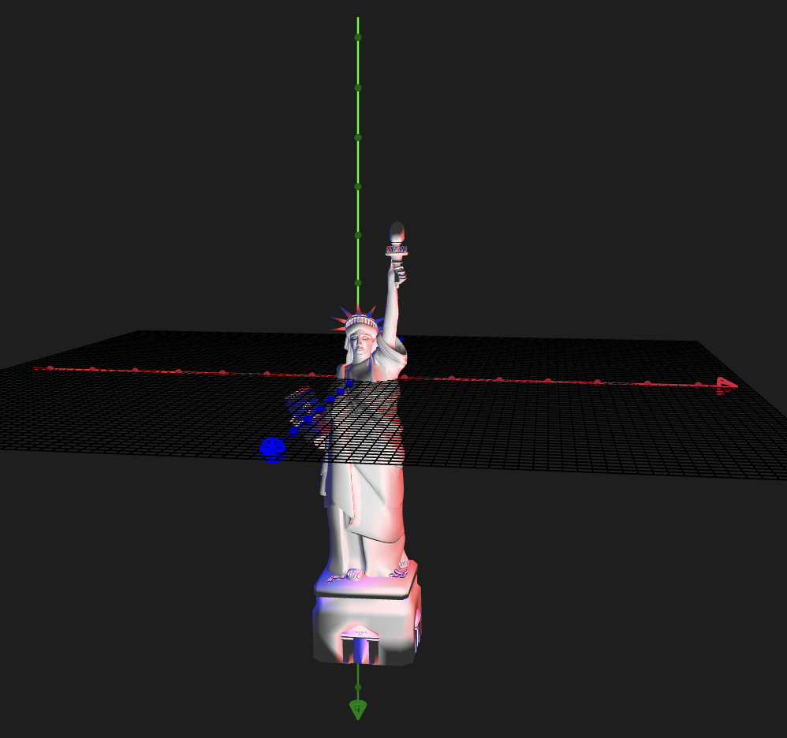   

key 0 will select the tripod already set in list.       
If we prefer moving *liberty*, we can set it directly in the console:   
``` kb.toMove = liberty ```    
or , if we aim to change quickly between camera and liberty, we can add it to the kb list :  
 ```kb.objectsToMove.push(liberty);```     
Now, you can quickly swap :    
 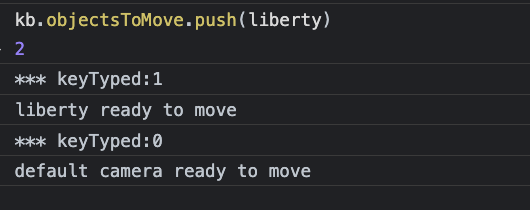   
 

