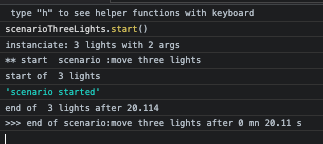
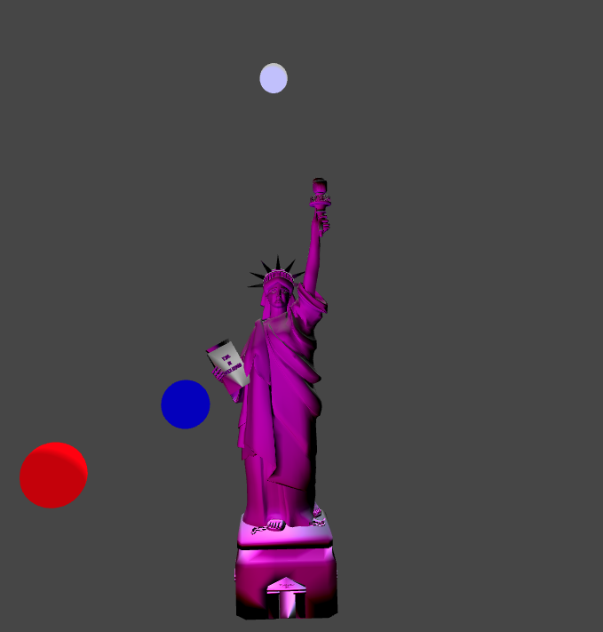
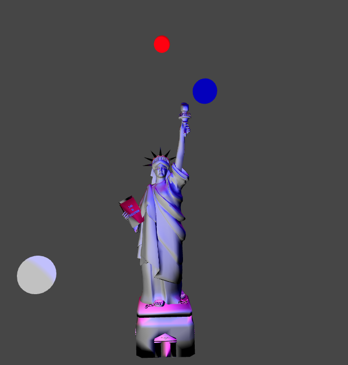
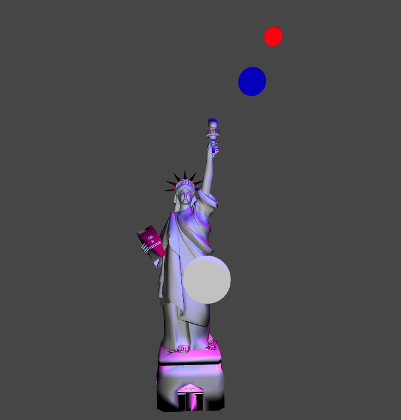

# Specific ligthing 
p5 has mainly four ways to set lights :  
- **ambientLight** :  the global diffused light without direction 
- **directionalLight**  : a light that comes from afar and stays afar and is oriented in one direction. 
- **pointLight**: a moveable light that shines at its 3D place in all directions. 
- **spotLight** : a moveable light with settings for direction of light.   

## using preset functions for facilitate enlightment
This framework way is:    
 Define an *enlight*: variable    ```var enlight; ```   
 Setup *enlight* with a default light  ```  enlight= () =>lights;``` lights is a standard light function in p5   
 Call *enlight()*  in your draw loop   ```enlight();```    
 Change *enlight* by some other functions to change enlightment :  

 ```javascript 
function red_atmosphere(){
    ambientLight("darkred");
    //'red on below' look at y negative
    directionalLight(250, 0, 0, 0, -1, 0);
    // orange on left : look at some X ( positive: right screen ) 
    directionalLight(255, 165, 0, 1, 0, 0);
    // gold on top : look at y>0 bottom 
    directionalLight(color("gold"), 0, 1, 0);
    // light in front look at z<0
    directionalLight(color("black"), 0, 0, -1);
}
function draw() {
...
  enlight();
  obj_1.draw();
  if (frameCount == 200) enlight = red_atmosphere; 
}
```
   
This way, you can set and change enligthment dynamically in your scenarios. 

# pointLight
## working with pointLight wrapped into MoveablePointLight 
PointLighst are more specific and it's a bit more difficult to develop a good enlightment.   
The class *MoveablePointLight* allows to wrap the *pointLight* function of p5 in a moveable object.    
### sample with Liberty
If you have a look at *7-cameraLiberty* code, you'll find an enlightment for Liberty with : 
``` javascript 
  ambientLight(50)
  pointLight(color('blue'), -300, -100 ,-250);
  pointLight(color('white'),100,100, 250);
  pointLight(color('red'),300,0, 0); 
``` 
We do the same thing with moveable objects.  
First create the points in setup  : 
```javascript 
 pointBlue = new MoveablePointLight({
    name: "blue light",
    visible: true,
    color: "blue",
    position: [-300, -100 ,-250],   // replace the default [0,0,0] to see something 
    showMe: true
  })
  pointWhite = new MoveablePointLight({
    name: "white light",
    visible: true,
    color: "white",
    position: [100,100, 250],   // replace the default [0,0,0] to see something 
    showMe: true
  })
  pointRed = new MoveablePointLight({
    name: "red light",
    visible: true,
    color: "red",
    position: [300,0, 0],   // replace the default [0,0,0] to see something 
    showMe: true
  })
  // can lights as default :  enlight = () =>lights;
  enlight = threeSpots;
  ```  
  Notice the enlight function used in draw is now the following  *threeSpots* function : 
  ```javascript 
  function threeSpots(){
  pointBlue.enlight();
  pointWhite.enlight();
  pointRed.enlight();
}
``` 
#### *showMe* property defined in config 
In the constructor, we give a variant with ```showMe: true ``` .     
This allows the pointLights to show where they are in the 3D space :   
   
#### using console and keyboard helper 
With keyboard helper, we can move any moveable object with x,y,z and > <    
To mark the object to move, one can use the repl (read-eval-print-loop) javascript console and give instructions :  
(Be aware: instructions are striked in console, but you must move cursor and click on canvas to use keyboard keys)   


##### some command for kbHelper 
In the previous, we set the object to move by :   
```kb.toMove = pointWhite```    
Then we move it on (y) , then show axis (a), then move on (z) and (x) .   
Once happy, use *enter* to get coordinates of the object moved to put in your code.    
Finally, we change directly in the console the *config.showMe* property (and the axis) to see only final result.   
##### use a catalog to switch quickly 
We can set (or have set in code) a catalog of objects to move with :   
```kb.objectsToMove = [pointBlue, pointWhite, pointRed] ```    
With that, striking 0, 1 or 2 helps to change quickly of object to move.    


## pointLights in a journey  
As any moveable objects, pointLights can be moved on defined trajectories.  
A pointLight cannot be rotated as this has no effect.     

# spotLight
## working with spotLight wrapped into MoveableSpotLight 
A spotLight is oriented and its light goes only in one direction. 


# moving several objects in a journey 
## Grouping objects  
A journey is the definition of trajectories for parameters of a *BasicObject*, ie an object having a *config* literal to hold its properties.    
When the generator *scriptJourney* is activated by a *scenario* , it receives two arguments : [the journey definition, the target object ].   
To respect this model, we can set a new object holding the others :    
```javascript 
 // create a group with the three lights
  threeLightsGroup = new BasicObject({
    name: "3 lights",
  });
  // use extend as the keys are not in the controled class definition
  threeLightsGroup.extendConfig({
    blue: pointBlue,
    red: pointRed,
    white: pointWhite,
  });
```
Notice we use *extendConfig* to avoid errors as the new properties are not in the class definition.   
Notice that the objects pointBlue, pointRed, pointLight must be known when the group is created.   
### parameters of an element in a higher level group 
At the first level, the *getData* method of BasicObject knows that it has to find a key in the config of the threeLightsGroup. So "blue" whill give access to the *pointBlue* object.   
To go deeper for interpreting a parameter of pointBlue , we must give the full chain inside pointBlue:  
``` "blue.config.position" ```.    
Using a group, a journey can move in a same run several Objects.   
### sample 
``` javascript 
var journeyFor3Lights = {
  duration_ms: 10000, // duration of the journey
  // array of parameters in this journey

  parameters: [
    {
      name: "blue.config.position", // the parameter involved in the journey
      start: [-100, 100, 200], // the start value of parameter. Optional.
      end: [100, -200, 100], // the destination value of parameter
    }
    ... the same for red.config.position, white.config.position 
```  
Now define the scenario :  

```javascript 
 scenarioThreeLights = new Scenario(
    { scenarioName: "move three lights", trace: true },
    [  // array of scripts for this scenario . Here just one 
      { scriptName: " 3 lights", generator: scriptJourney, arguments: [journeyFor3Lights,threeLightsGroup] }
    ] )

``` 
#### running a scenario with console 
To test quickly, as long as your scenario is a global variable, you can access it in the console to start it: ```scenarioThreeLights.start() ```   
   
 
 
     
Look at code : we reuse the Bezier curve of camera movement for white light and red light. The red one will take the inverse trajectory by using and *easingOnT* function :   

``` javascript 
    {
      name: "white.config.position", 
      start: [200,-400,-200], 
      end:   [20,50,350], 
      bezier: {
        inter1: [-380,-370,-240], 
        inter2: [-450,250,310] 
      },
    },
     {
      name: "red.config.position", 
      easingOnT: (t)=> (1-t),
      start: [200,-400,-200], 
      end:   [20,50,350], 
      bezier: {
        inter1: [-380,-370,-240], 
        inter2: [-450,250,310] 
      },
    },
```  
Once satisfied, set to false the *showMe* properties of the pointLights. 


