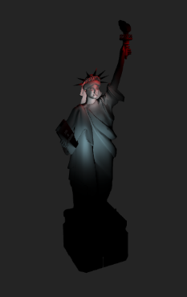
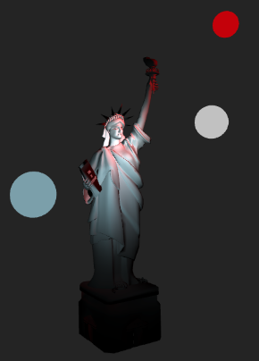

# Specific ligthing 
p5 has several ways to set lights :  
- **ambientLight** :  the global diffused light without direction 
- **directionalLight**  : a light that comes from afar and stays afar and is oriented in one direction. 
- **pointLight**: a moveable light that shines at its 3D place in all directions. 
- **spotLight** : a moveable light with settings for direction of light.   

## using preset functions for facilitate general enlightment
How i do in my sketches:      
 Define a global variable    ```var enlight; ```   that will hold a function.   
 Setup *enlight* with a default anonymous function  ```  enlight= () =>lights;``` *lights* is a standard light function in p5   
 Call this function in your draw loop   ```enlight();```    ( this time with () )   
 You can change *enlight* on the fly by some other functions to change enlightment :  

 ```javascript 
function red_atmosphere(){
    ambientLight("darkred");
    //'red on below' look at y negative
    directionalLight(250, 0, 0, 0, -1, 0);
    // orange on left : look at some X ( positive: right screen ) 
    directionalLight(255, 165, 0, 1, 0, 0);
    // gold on top : look at y>0 bottom 
    directionalLight(color("gold"), 0, 1, 0);
    // light in front look at z<0
    directionalLight(color("black"), 0, 0, -1);
}
function draw() {
...
  enlight();
  obj_1.draw();
  if (frameCount == 200) enlight = red_atmosphere; 
}
```
   
This way, you can set and change enligthment dynamically in your scenarios. 

# pointLight
## working with pointLight wrapped into MoveablePointLight 
PointLights are localized and it's a bit more difficult to develop a good enlightment.   
The class *MoveablePointLight* allows to wrap the *pointLight* function of p5 in a moveable object.    
### sample with Liberty
If you have a look in the previous chapter sample code (*7-cameraLiberty*), you'll find a fixed enlightment for Liberty with three pointLight calls: 
``` javascript 
  ambientLight(50)
  pointLight(color('blue'), -300, -100 ,-250);
  pointLight(color('white'),100,100, 250);
  pointLight(color('red'),300,0, 0); 
``` 
### using moveablePointLight
We do the same enlightment but with moveable objects.  
First we create the moveable points in setup  : 
```javascript 
 pointBlue = new MoveablePointLight({
    name: "blue light",
    visible: true,
    color: "blue",
    position: [-300, -100 ,-250],  
    visible: true
  })
  pointWhite = new MoveablePointLight({
    name: "white light",
    visible: true,
    color: "white",
    position: [100,100, 250],   
    visible: true
  })
  pointRed = new MoveablePointLight({
    name: "red light",
    visible: true,
    color: "red",
    position: [300,0, 0],   
    visible: true
  })
  // replace default enlightment by our
  enlight = threeSpots;
  ```  
  Notice the enlight function used in draw is now the following  *threeSpots* function : 
  ```javascript 
  function threeSpots(){
   pointBlue.enlight();
   pointWhite.enlight();
   pointRed.enlight();
}
``` 
#### *visible* property defined in config 
In the constructor, we give a variant with the property ```visible: true ``` .     
This allows the *pointLights* to show where they are currently in the 3D space :   
   
#### using console and keyboard helper 
With keyboard helper, we can move any moveable object with x,y,z and > <    
To mark the object to move, one can use the repl (read-eval-print-loop) javascript console to set the object to move with keyboard: 
 


##### traces of kbHelper 
In the previous, we set the object to move by :   
```kb.toMove = pointWhite```   The cursor is on the console area. 
Then the cursor is set on the canvas area (clic on):    
We move the light on (y) , we show axis (a), we move on (z) and (x) .   
Once happy, we use *enter* to get coordinates of the object and set it in the code.        
Finally, we change a property with the console : *visible* property to see only final result.   

##### Tip : use the kb catalog to switch quickly 
We can set in console (or have set in your setup code) the catalog of objects to move with :   
```kb.objectsToMove = [pointBlue, pointWhite, pointRed] ```    
With that, striking 0, 1 or 2 helps to change quickly of object to move.    

 
# Moving several objects in a journey
We can define a journey for a *pointLight* as for any object with reachable properties. 
But it seems more interesting to design a common journey for several objects.    

## Grouping objects  
To be able to access properties of several objects in a same journey definition, it's enough to create a group :    
```javascript 
   /*
   create a group with the three lights to move them easily in a same journey. 
   As no need of methods, we can use directly a simple literal 
  */
  threeLightsGroup = {
    name: "3 lights",
    blue: pointBlue,
    red: pointRed,
    white: pointWhite,
  };
```   
Notice that the objects *pointBlue, pointRed, pointLight* must be known when the group is created.   
### parameters of an element in a higher level group   
Using a group, a journey can move in a same run several Objects.   
### sample 
``` javascript 
var journeyFor3Lights = {
  duration_ms: 10000, // duration of the journey
  // array of parameters in this journey

  parameters: [
    {
      name: "blue.position", // the parameter involved in the journey
      start: [-100, 100, 200], // the start value of parameter. Optional.
      end: [100, -200, 100], // the destination value of parameter
    }
    ... the same for red.position, white.position 
```  
Now define the scenario :  

```javascript 
 scenarioThreeLights = new Scenario(
    { scenarioName: "move three lights", trace: true },
    [  // array of scripts for this scenario . (Here just one)
      { scriptName: " 3 lights", generator: scriptJourney, arguments: [journeyFor3Lights,threeLightsGroup] }
    ] )
``` 
#### tip: running a scenario with console 
To test quickly, as long as your scenario is a global variable, you can access it directly in the console and start it: ```scenarioThreeLights.start() ```   
   
 
 
     
Look at code : we reuse the Bezier curve of camera movement for white light and red light. The red one will take the exact inverse trajectory by using and *easingOnT* function :   

``` javascript 
    {
      name: "white.position", 
      start: [200,-400,-200], 
      end:   [20,50,350], 
      bezier: {
        inter1: [-380,-370,-240], 
        inter2: [-450,250,310] 
      },
    },
     {
      name: "red.position", 
      easingOnT: (t)=> (1-t),
      start: [200,-400,-200], 
      end:   [20,50,350], 
      bezier: {
        inter1: [-380,-370,-240], 
        inter2: [-450,250,310] 
      },
    },
```  
(if you don't see the white ball, think to set pointWhite.visible = true )
#### Tips for journey parameters 
As scriptJourney uses a dot notation to access parameters, you can stack as many groups as you want , group of groups, etc.  You just have to give the right path to the parameter you want to see evolving in time:  
*name: "humanGroup.John.eyeLeft.fill.color "*
 
# spotLight 
## working with spotLight wrapped into MoveableSpotLight
This is quite the same class that previously with some new properties :   
```javascript 
  constructor(instanceProperties) {
    super();
    // add local default extension
    extendProperties(this, 
      {
        name:"Spot Light no name",
        direction: [0, 0, -1], //  define a vector x,y,z for light direction . default for z to -z
        angle:  PI/3 , // spot works with Radians 
        concentration: 100,
      });
    // apply variant if called with
    if (instanceProperties != null) patchProperties(this, instanceProperties);
  }
``` 
As previously we create three lights with position and direction like the first one *spotBlue* : 
```javascript 
  spotBlue = new MoveableSpotLight({
    name: "blue light",
    lit: true,
    color: "lightblue",
    position : [-230,50,250] ,
    direction: [1,0,-1],   // left side 
    visible: true,
  });
  ...
  ``` 
  The code is similar to previous with pointLights.   
  I use the keyboard helper to move the spotlights, up to have a first result :    
     

#### feedback 
I do not master spotlight on parameters *angle and concentration*.  
I set the default values of P5 in the default properties of the class: 

```javascript 
        angle:  PI/3 , // spot works with Radians 
        concentration: 100,
```
These default values was used to create the previous images. 

I observe that minimizing *concentration* maximize the circle of lights.  
Below same code with a *concentration:20* for the lights.   
  

### Use all capacities of the framework  
Using *kbHelp()* you can move any light in any direction to observe result.   
With *REPL* of the console, you can change immediately any property of any light and see the result.   


HTH 


