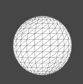
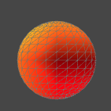
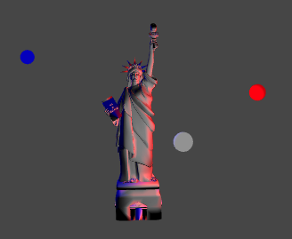
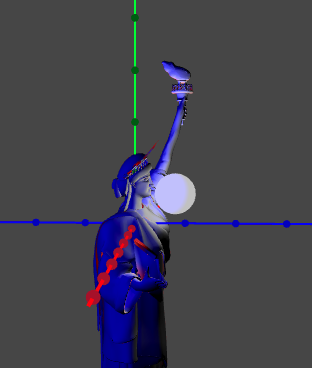
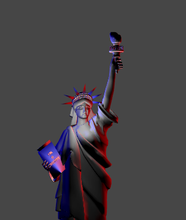
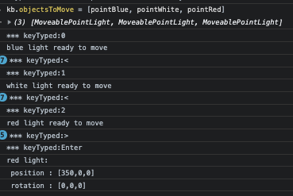

# Specific ligthing 
p5 has mainly three ways to set lights :  
- **ambientLight** :  the global diffused light without direction 
- **directionalLight**  : a light that comes from afar and stays afar and is oriented in one direction. 
- **pointLight**: a moveable light that shines at its 3D place in all directions. 
- **spotLight** : a moveable light with settings for direction of light.   

## using preset functions for facilitate enlightment
 define an *enlight* variable    ```var enlight; ```   
 setup *enlight* with default light  ```  enlight= () =>lights;``` lights is a standard light function in p5   
 call *enlight()*  in your draw loop   ```enlight();```
 change *enlight* by some other functions to change enlightment :  

 ```javascript 
function red_atmosphere(){
    ambientLight("darkred");
    //'red on below' look at y negative
    directionalLight(250, 0, 0, 0, -1, 0);
    // orange on left : look at some X ( positive: right screen ) 
    directionalLight(255, 165, 0, 1, 0, 0);
    // gold on top : look at y>0 bottom 
    directionalLight(color("gold"), 0, 1, 0);
    // light in front look at z<0
    directionalLight(color("black"), 0, 0, -1);
}
function draw() {
...
  enlight();
  obj_1.draw();
  if (frameCount == 200) enlight = red_atmosphere; 
}
```
   
This way, you can set and change enligthment dynamically in your scenarios. 

## working with pointLight wrapped into MoveablePointLight 
PointLighst are more specific and its more difficult to develop a good enlightment.   
The class MoveablePointLight allows to wrap the pointLight function of p5 in a moveable object.    
### sample with Liberty
If you have a look at 7-cameraLiberty code, you'll find en enlightment for Liberty with : 
``` javascript 
  ambientLight(50)
  pointLight(color('blue'), -300, -100 ,-250);
  pointLight(color('white'),100,100, 250);
  pointLight(color('red'),300,0, 0); 
``` 
We do the same thing with moveable objects. First create the points in setup  : 
```javascript 
  pointBlue = new MoveablePointLight({
    visible: true,
    color: "blue",
    position: [-300, -100 ,-250],   // replace the default [0,0,0] to see something 
    showMe: true
  })
  pointWhite = new MoveablePointLight({
    visible: true,
    color: "white",
    position: [100,100, 250],   // replace the default [0,0,0] to see something 
    showMe: true
  })
  pointRed = new MoveablePointLight({
    visible: true,
    color: "red",
    position: [300,0, 0],   // replace the default [0,0,0] to see something 
    showMe: true
  })
  // can lights as default :  enlight = () =>lights;
  enlight = threeSpots;
  ```  
  Notice the enlight function used in draw is now the *threeSpots* function : 
  ```javascript 
  function threeSpots(){
  pointBlue.enlight();
  pointWhite.enlight();
  pointRed.enlight();
}
``` 
#### showMe property in config 
In the constructor, we give a variant with ```showMe: true ``` .     
This allows the pointLights to show where they arein space :   
   
#### using console and keyboard helper 
With keboard helper, we can move any moveable object with x,y,z and > <    
To mark the object to move, one can use the repl console and give instructions :  
(Be aware: instructions are striked in console, then move cursor and click on canvas to use keyboard keys)   



##### some command for kbHelper 
In the previous, we set the object to move by :   
```kb.toMove = pointWhite```    
Then we move it on y , then show axis (a), then move on z and x .   
Once happy, use *enter* to get coordinates of the object moved.    
Finally, we change by code in console the *config.showMe* property (and the axis) to see final result.   
##### use a catalog to switch quickly 
We can set (or have set in code) a catalog of objects to move with :   
```kb.objectsToMove = [pointBlue, pointWhite, pointRed] ```    
With that, striking 0, 1 or 2 helps to change quickly of object to move.    


## pointLights in a journey  
As any moveable objects, pointLights can be moved on defined trajectories.   


