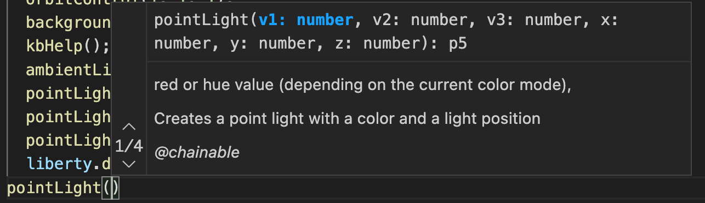

# Environment 
## Tools for dev 
### visual studio code 
No comment good product.   
For P5 syntax, i added the intellisense models .ts ( see under p5/intellisense) and set in source code the following control line at top : 
```///<reference path="../../p5/intellisense/p5.global-mode.d.ts" />```  
This allows to have inline help :   


#### a little drawback 
VSC counts this line as line 1. As the line in not in the js code, the line numbers given by the console in case of errors are shifted of 1 relative to VSC. 
##### .gitignore for vsc
 Get latest from https://github.com/github/gitignore/blob/master/VisualStudio.gitignore   
### local server : python3 http.server 
To go quickly, i catalog a **py.command** to start the server and launch a navigator in parallel :  
``` c 
#!/bin/zsh
# has to be run from terminal by ./py.command  in the project folder 
# it starts automatically a chrome nav. It will say 'unavailable' until python starts 
open -a /Applications/"Google Chrome.app" "http://localhost:8081" 
# start module http. Be aware port # be the same as chrome. I use to set a different port per projects. 
python3 -m http.server 8081
``` 
I was previously on windows with a similar **py.bat** :
``` c
start chrome http://localhost:8080
python -m http.server 8080
```  
Just have to type the command in the terminal of vsc.   

### git 
of course. 
### navigators for P5 webgl: Chrome, Brave, Firefox, edge 
I use mainly **Chrome** or **Brave**, two similar chromium based navigators.   
My code runs well on all three navigators, but definitively **avoid *Safari*** not able to work with p5 in webgl.  
#### some tips 
When several pieces of code change, don't forget to ask Chrome to full reload the whole: *command Shift r*      
To quickly see the console : *command option i*
#### to film a sketch in full screen 
First set Chrome full screen  
Then ask it to hide its command bar :  *command shift F*  
Hide the cursor and scroll bars in html page if any: 
``` javascript 
function hideCursorAndScrollBar(){
  document.body.style.cursor = 'none';
  document.body.style.overflow= 'hidden';
}

function restoreCursorAndScrollBar() {
  document.body.style.cursor = 'default';
  document.body.style.overflow= 'visible';
}
``` 
These functions are connected in the *kbHelper* with the keys "-" and "+". 

## Tools for graphics 
### into this framework: util/utilGeometry.js 

If you are aware of *left hand / right hand in 3D* options, you can have some surprise when using a **.obj** model loaded from internet.   

One main drawback is the p5 y axis is looking down and a lot of obj models were designed y up.   
Fortunately, a loaded *.obj* ends as a **p5.Geometry** object where it's easy to manipulate data.  
When needed, i apply some changes once the obj is loaded with the following functions:  
```javascript 
/*
 rectify a Geometry 
 useful for .obj as P5 uses y down and others use y up :   multiply by 1,-1,1
  can also reverse x and y : multiply by -1,-1,1 
  To scale model once loaded  : multiply by 2,2,2 
*/
function multiplyGeometry(someGeo, aVector){
 for (let v of someGeo.vertices){
     v.mult(aVector)
 }
}
``` 
Another common trouble with p5 and texture (when loaded with corresponding.obj on internet) is that p5 reverses start and end angles, resulting in an inverted texture.  
To rectify i use the following : 

```javascript 
/*
 p5 reverses y when reading  vt 0, 0.2, it creates uvs 0,0.8
 The following function rectify the right values to display texture 
 Do it in setup, once .obj is fully loaded
 ( Can save result with saveGraphicsOnFileObj)
*/
function rectifyObjUvsForP5AfterLoad(forme) {
    for (var i = 0; i < forme.uvs.length; i++) {
      forme.uvs[i][1] = 1 - forme.uvs[i][1];
    }
  }
  ``` 
  ### Blender 
  Blender is a powerful tool but hard to master.   
  I use a few percent to rectify **.obj** files for p5 sketches:    
  *import obj - scale /move/ rotate / center  - export obj*   

## known problems 
The js files are not organized with controled dependancies...  
Sometimes a full reload fails (chrome command shit r) with errors. Just have to retry one or two times. All the samples were verified.   


  
