# A framework to animate your P5 sketches 
This work comes from a realization made for a cyber Opera where graphics animations where needed.   
P5 allows many primitives to animate objects, but a framework appears as imperative to stay in schedule.  
This is a review of what was learned in this adventure.  

## <a href = "./chapters/chap0-basicObjects.md">chapter 0 </a>: basic objects 
To have something to move and draw, a hierarchy of three classes : 
- **MoveableObject**    to hold basic elements like position or rotation.  
- **GraphicObject**     to define some specific shape to draw itself in place
- **GraphicObjectModel**  extended to use an external model (.obj, .stl) (or any p5 Geometry) with optional texture.    
  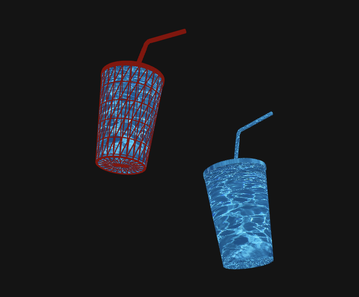 </img>
#### code examples
sketches/0-basicObject   
sketches/1-cupOfCoke 

## <a href = "./chapters/chap1-Literals.md">chapter 1 </a>: Literals and class hierarchy
Documentation of the framework's functions around manipulation of literals objects with more security.   
See file : **chap1-literals.md**

## <a href = "./chapters/chap2-scenario.md"> chapter 2 </a>: scenario 
A scenario is a way to schedule steps of animation in a practical way.   
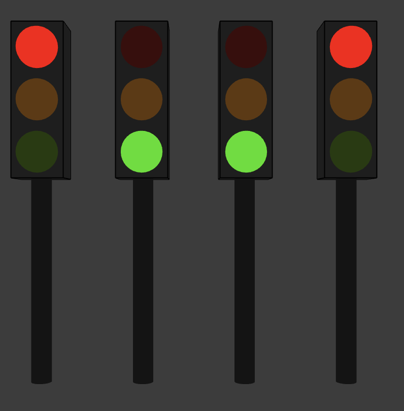</img>  

#### code example
sketches/2-trafficLights

## <a href = "./chapters/chap3-basicMovement.md">chapter 3 </a> : basic movement 
How to create a journey able to make variations of any data in time.  
Use generic descriptions to define expected start and end values for the journey.   
 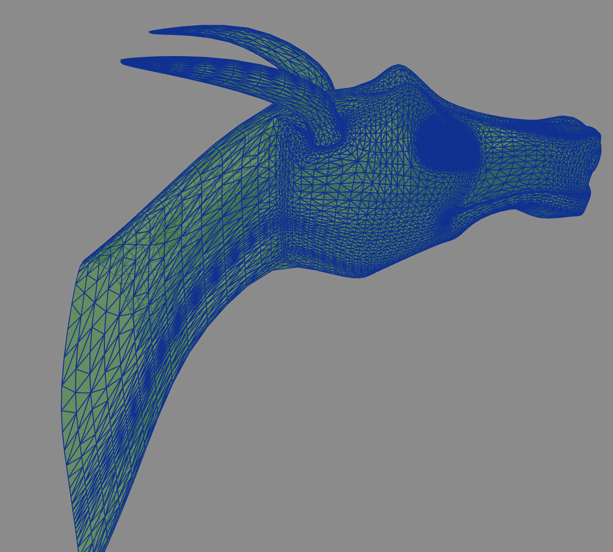 </img> ... 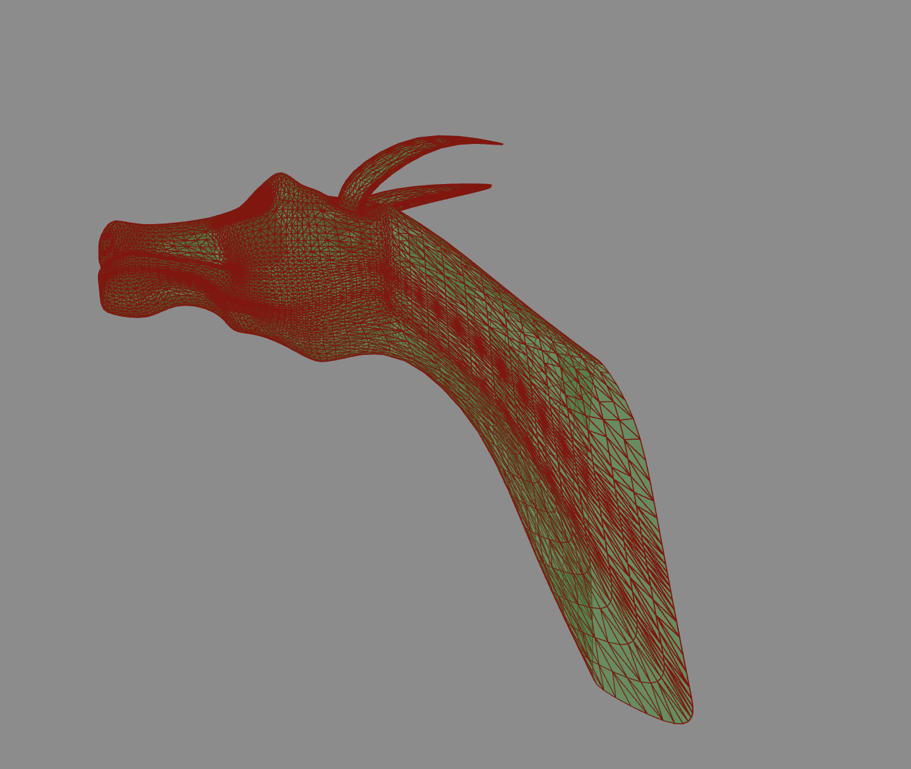 </img>   
#### code example
sketches/3-basicMovement 

## <a href = ./chapters/chap4-advancedAnimations.md>chapter 4 </a>: define variation along time 
How to define speed variations for a trajectory using functions to modify estimated time.  
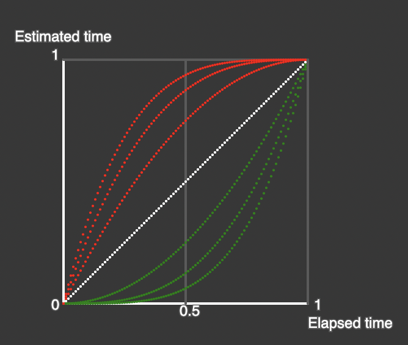 </img>
#### code example
sketches/4-advanceMovement   
sketches/990-showCurvesOnTime    

## <a href = "./chapters/chap5-advancedAnimations.md">chapter 5 </a>: decoupling time between parameters 
You can give more precise timing to your parameters inside a same journey so that they don't all start at the same time or last the same duration.    
 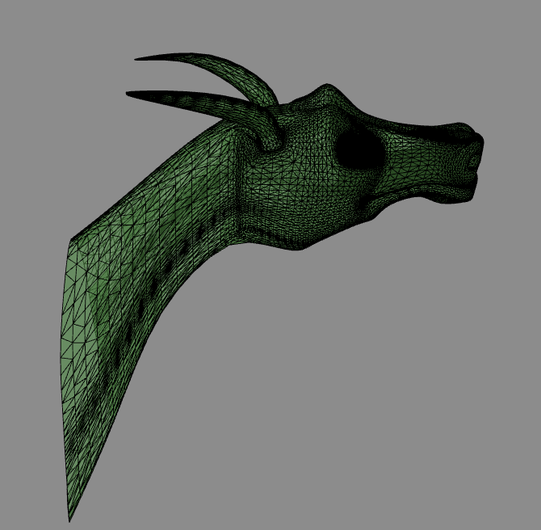 </img> ... 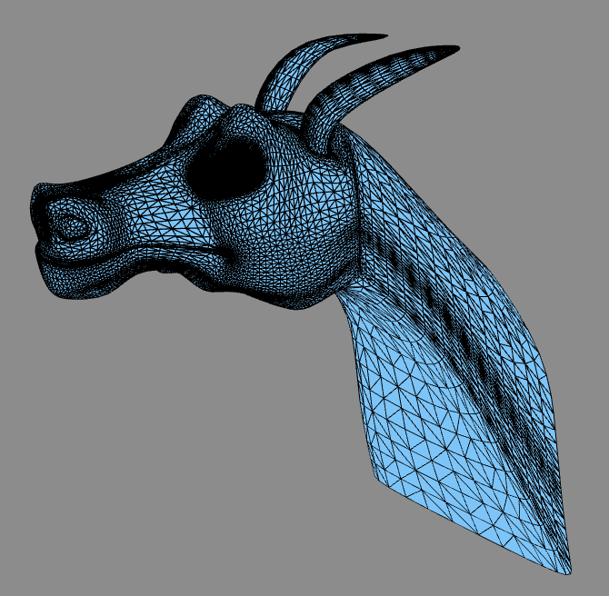 </img> ...   </img> 
#### code example
sketches/5-advanceMovement   

## <a href = "./chapters/chap6-bezierTrajectory.md">chapter 6</a> : use Beziers curves in space 
Design easily and use Bezier trajectories for your parameters.  
Learn to design a Bezier with an helper using keyboard.  
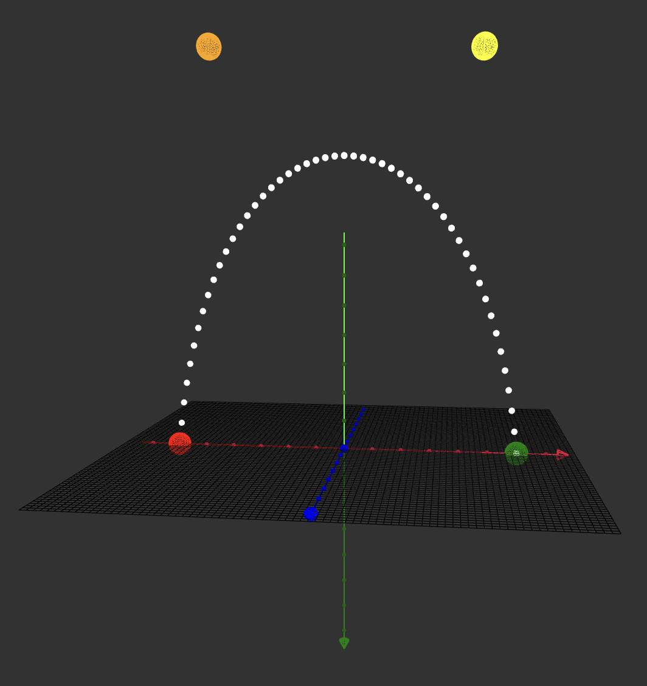 </img> </img>
#### code example
sketches/6-bezierTrajectory    
sketches/991-bezierHelper   

## <a href = "./chapters/chap7-camera deplacement.md">chapter 7 </a>: move a camera using a tripod 
Defining a tripod as a moveable element and mounting a camera on this tripod allows to set it in any scenario to apply movements to the camera.
Sample shows a jump tripod to tripod  then a **smooth camera movement** using a Bezier curve.      
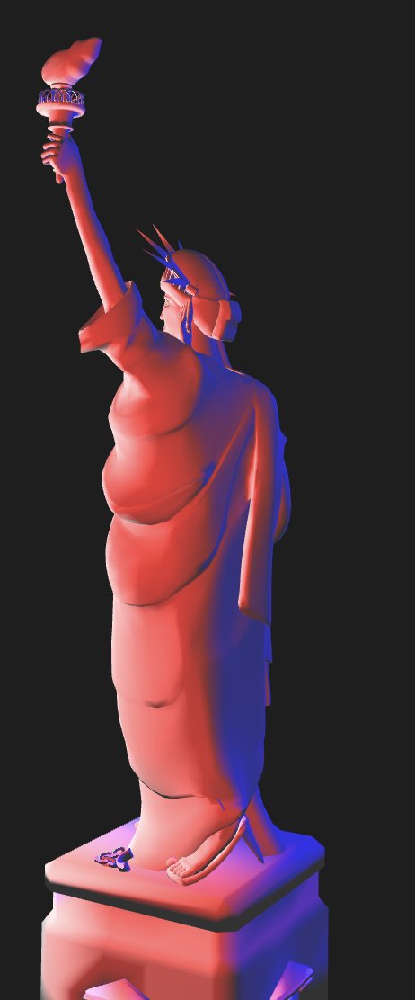</a> 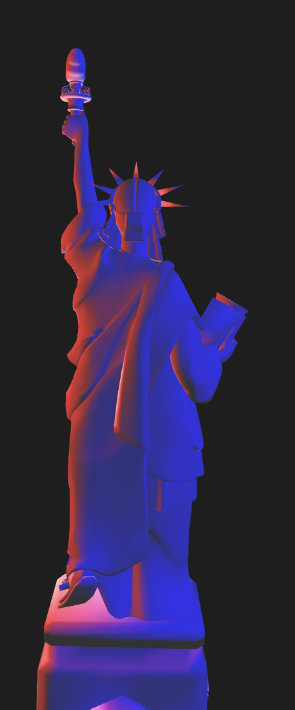</a> 
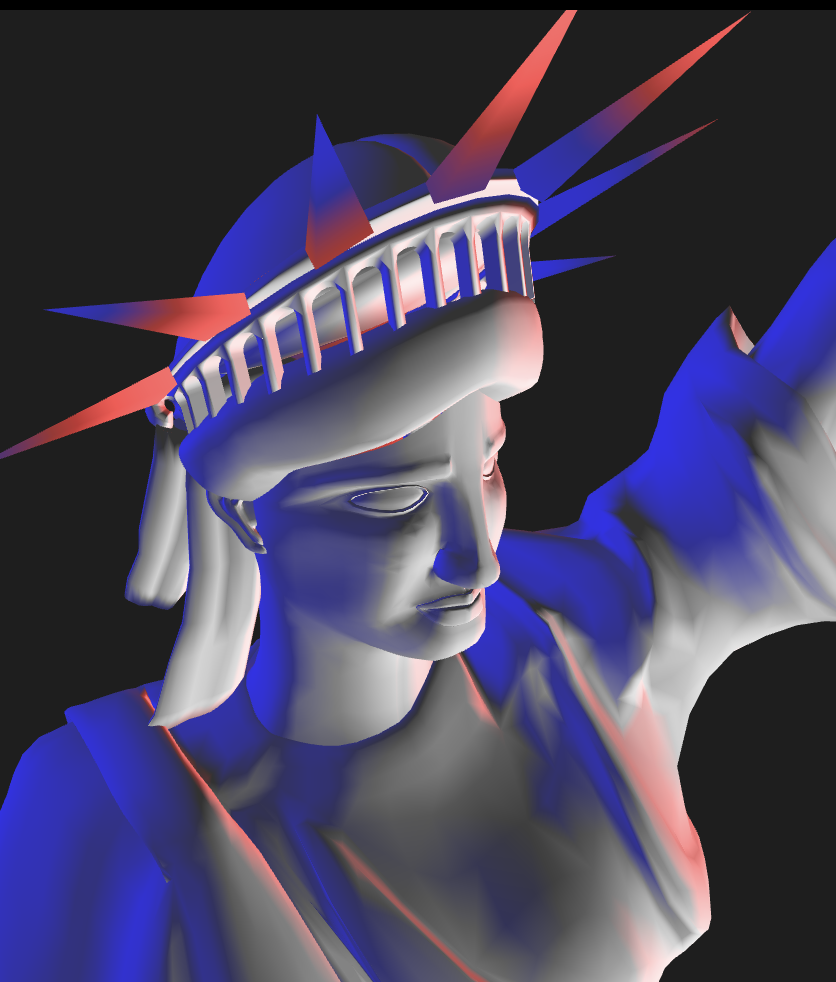</img>  
#### code example
sketches/7-cameraLiberty    

# Miscelleanous 
<a href = "./chapters/tech0-environment.md">Dev environment notes</a> 
 
#### stay in touch 
know-how from cyber-opera not yet documented :   
- specific lighting per graphic object   
- using an image as background in a webgl canvas 
- Several ways to have a Video as background with P5 
- code once and draw on several places ( canvas, graphics ) 
- superimposed several layers of canvas and pilot them by scenario 
- working with two external screens and a 1920x3840 canvas
- ...
