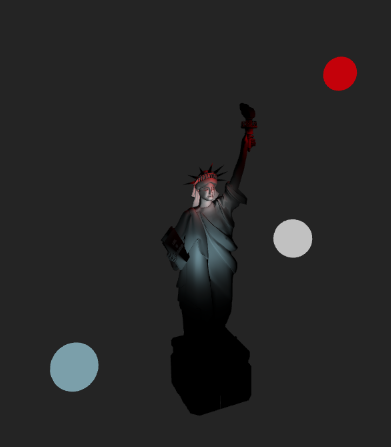

# A framework to animate your P5 sketches 
This work comes from a realization made for a cyber Opera where graphics animations where needed.   
P5 allows many primitives to animate objects, but a framework appears as imperative to stay in schedule.  
This is a review of what was learned in this adventure.  

## two pilars 
- Usage of **literals** to hold properties of objects  
- A tandem between **generators** in charge of actions and **scenario** responsible for restarting generators in time. 

## [chapter 0](./chapters/chap0-Literals.md): Literals and class properties
Properties in a class are hold as a literal object.  
Mechanisms are provided to control class definition and instance variations.  

## [chapter 1](./chapters/chap1-basicObjects.md): Literals and class properties
To have something to draw and animate, a hierarchy of four classes : 
- **BasicObject**:     a class that do nothing except implementing useful principles 
- **MoveableObject**:    to hold properties for moving elements like position or rotation.
   - Main derived classes : *GraphicObject, Tripod4Camera, MoveablePointLight, MoveableSpotLight*  
- **GraphicObject** :    object able to draw itself in place
- **GraphicObjectModel**: the previous extended to use an external model (.obj, .stl) (or any p5 Geometry) with optional texture.    
   </img>
#### code examples
sketches/0-basicObject   
sketches/1-cupOfCoke 

## [chapter 2](./chapters/chap2-scenario.md) : scenario 
A scenario is a way to schedule steps of animation in a practical way.   
</img>  

#### code example
sketches/2-trafficLights

## [chapter 3](./chapters/chap3-basicMovement.md) : basic movement 
How to create a journey able to make variations of any data in time.  
Use generic descriptions to define expected start and end values for the journey.   
  </img> ...  </img>   

#### code example
sketches/3-basicMovement  

## [chapter 4](./chapters/chap4-advancedAnimations.md) : define variation along time 

How to define speed variations for a trajectory using functions to modify estimated time.  
 </img>

#### code example
sketches/4-advanceMovement   
sketches/990-showCurvesOnTime    

## [chapter 5](./chapters/chap5-advancedAnimations.md): decoupling time between parameters 
You can give more precise timing to your parameters inside a same journey so that they don't all start at the same time or last the same duration.    
  </img> ...  </img> ...   </img> 
#### code example
sketches/5-advanceMovement   

## [chapter 6](./chapters/chap6-beziersTrajectory.md): use Beziers curves in space 
Design easily and use Bezier trajectories for your parameters.  
Learn to design a Bezier with an helper using keyboard.  
 </img> </img>
#### code example
sketches/6-bezierTrajectory    
sketches/991-bezierHelper   

## [chapter 7](./chapters/chap7-cameradeplacement.md) : move a camera using a tripod 

Defining a tripod as a moveable element and mounting a camera on this tripod allows to set it in any scenario to apply movements to the camera.
Sample shows a jump tripod to tripod  then a **smooth camera movement** using a Bezier curve.      
</a> </a> 
</img>  

#### code example
sketches/7-cameraLiberty    

## [chapter 8](./chapters/chap8-specificLighting.md) : enlightments  
See and move your lights, see where they are, choose right places with keyboard, organize trajectories, etc.  

#### code example
sketches/8-ligthingObject   
sketches/8-ligthingObjectSpot
 
### [Annexes](./chapters/chap999-Environt.md):Environment and some technical stuff 
### [Gallery](./Gallery/terresRares.md) : images from p5 animation for cyber Opera Terres Rares