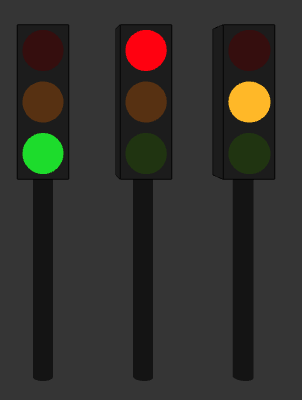

# A framework for p5.js animations 
Coding: How to drive your animations with scripts that take care of timing & scheduling.   
Samples are done in p5.js sketches, but code can run in any js environment.    
## scenario 
A **scenario** plays a **script**, or a series of **scripts**, given at construction.    
Once a script is finished, the scenario runs the next one in the list.  
Cutting a long script in a list of smaller scripts helps maintain readable program.  
### script 
A **script** is any javascript generator (function *)   
A **generator** executes any javascript code up to the next **yield** instruction or its own end.   
When a yield instruction is found, the generator code stops and returns to caller.   
When caller calls it again, it continue its code after the yield where it stops.   
#### step 
One step into a script is a part of code that run without stopping:  
- from beginning to first yield
- from yield to yield 
- from last yield to end of code. 

## how it works 
When a scenario starts, it starts the first script which starts its first step.   
The script returns either by : 
- yield                 -> The scenario will wait the default *interval* ms of the scenario before calling again the script
- yield xxxxx   -> The scenario will wait the number xxxxx of ms  
- a return instruction  -> The scenario will quit this script and take the following if any
- the end of script.    -> Same as above. 
  
The scenario has an *advance* function that calls the script and, on return, push itself in the js event loop at some timeout for later.  
When awaked by this timeout, *advance* call the script again. 
## how it stops 
A scenario stops when the last script of its collection returns at the end of its code or by a *return* instruction anywhere.   
A scenario can also be stopped at any time by its owner with the method ```scenario.stop()```
## miscellaneous about scenarios 
Several scenarios can be started and run in parallel with their own scheduling.  
A scenario can start another scenario.  
A scenario can wait the end of another scenario by pooling the status of the other :  ```while (!theOther.isEnded) yield 100```

# A simple Example with traffic lights  
We explore three ways to use scenario to understand what's behind the scene.  
The goal is to enlight a (european) traffic lights with defined durations  
## TrafficLight class

</img>   
first we create a class with useful parameters in a literal object:    
``` javascript 
class TrafficLight {
  constructor() {
    this.visible = true;  
    this.active = false;  // lights stay all grey
    this.lights = {
      green:  { active: false, colors: { on: "#3ADF00", off: "#243B0B" } },
      orange: { active: false, colors: { on: "#FFBF00", off: "#61380B" } },
      red:    { active: false, colors: { on: "#FF0000", off: "#3B0B0B" } },
    };
  }
  ```
  The method *draw* do the job of drawing itself using its current parameters.    
  ``` javascript   
  draw() {
    if (!this.visible) return;
    push(); // protect others
    this.drawHousing(); // draw the surrounding box
    // add the three lights 
    noStroke();
    translate(0, 50, 20);
    this.drawLight("green");
    translate(0, -50, 0);
    this.drawLight("orange");
    translate(0, -50, 0);
    this.drawLight("red");
    pop();
  }
  // draw the named light
  drawLight(name) {
    let opt = this.lights[name];
    if (opt.active && this.active) fill(opt.colors.on);
    else fill(opt.colors.off);
    sphere(20);
  }
  ```
   ## scenario to animate lights
The scenario refers to a unique script : *europeanScript* :  
   ``` javascript   
   var europeanScenario = new Scenario(
  {
      name: "european lights",
      trace: true,
  },
  europeanScript
);
```

<small> 
If several scripts are to be chained, constructor should have received an array of scripts.   
The previous is the same as *[europeanScript]* if you prefer.</small> 

One can observe that the literal in the constructor references only a part of the default config of the class Scenario.( *interval* is missing).The framework uses several functions around literal objects : copy, merge, control, etc. (in *utilConfig.js*)   
Within the constructor, the *defaultconfig* of the class is first copied, then the literal given in new is used to patch the named entries .

In the main prog, in the setup function of P5, we create the lights and then we starts the scenario: 
``` javascript 
function setup() {
  canvas = createCanvas(800, 800, WEBGL);
  canvas.position(0, 0);
  traffic_0 = new TrafficLight();
  // start the scenario 
  europeanScenario.start();
}
```
In the draw loop of P5, we ask the traffic_light to draw itself:
```javascript 
function draw() {
 orbitControl(1,1,1)
 background(60);
 traffic_0.draw();
} 
```
## The interesting part : the script in the scenario 
First, be aware of the special  ```function*``` which means this is a *generator* not a simple function.     
Each yield can return the number of <u>milliseconds</u> to wait before coming back.   
As we want a full time traffic_lights with this scenario, the script has an infinite loop ```while(true)```

``` javascript 
function* europeanScript() {
  console.log(" tuto: 2 seconds to wait before activating the lights");
  yield 2000;
  // activate the traffic light box
  traffic_0.active = true;
  console.log(" tuto: start an infinite loop ");
  while (true) {
    console.log("tuto: red light for 8 s");
    patchConfig(traffic_0.lights, { green: { active: false }, orange: { active: false }, red: { active: true }});
    yield 8000;  // code will be back here after 8 seconds 
    console.log("tuto: green light for 5 s");
    patchConfig(traffic_0.lights, {green: { active: true },orange: { active: false },red: { active: false }});
    yield 5000;
    console.log("tuto: orange light for 2 s");
    patchConfig(traffic_0.lights, {green: { active: false },orange: { active: true },red: { active: false }});
    yield 2000;
  } // while
}

```
A question could be : how to stop this behaviour as we leave an infinite loop in the script ?  
In the sketch, we will stop the scenario by the following : 
```javascript 
// the scenario runs for ever. We stop it after 1 mn to conclude this tuto
if(millis()>60000){
  if(!europeanScenario.isEnded) europeanScenario.stop();
  traffic_0.active = false;
}
```

Notice we have used here ```millis()```which is the elapsed time since the sketch is running.  
We could use the exact elapsed time of the scenario :   
```if( millis() - europeanScenario.startGlobalMs > 60000 )  ```
    
## some necessary enhancement  
You may have noticed that the script uses a global variable *traffic_0* : ```traffic_0.active , traffic_0.lights,... ```  which is a bad way of programming: This script cannot be used 'as is' for another traffic_light!     
-> This was in order to simplify as a first script. Don't work like this.   
## let the europeanScenario become a part of the class behavior
It seems logic that the scenario and the script be a part of the *TrafficLight* class as one of its behavior.     
First, we adapt the previous script to become an internal method of the class and rather than a named variable, we can use  *this* to access the current traffic lights.      
(Note the special notation of the internal method starting with a star * to indicate a generator)
``` javascript 
// enhancement:  the script is a method generator
* europeanInternalScript() {
    console.log(" 1_tuto: start an internal script ");
    // activate the traffic light box
    this.active = true;
    console.log(" 1_tuto: start an infinite loop ");
    while (true) {
      console.log("1_tuto: red light for 7 s");
      patchConfig(this.lights, { green: { active: false }, orange: { active: false }, red: { active: true }});
      yield 7000;
      console.log("1_tuto: green light for 5 s");
      patchConfig(this.lights, {green: { active: true },orange: { active: false },red: { active: false }});
      yield 5000;
      console.log("1_tuto: orange light for 2 s");
      patchConfig(this.lights, {green: { active: false },orange: { active: true },red: { active: false }});
      yield 2000;
    } // while
  }
  ``` 
The script is internal, make the scenario internal with a method to create and start it:   
```javascript   
// start the scenario, create it if necessary 
 startEuropeanScenario(){
    if (!this.europeanScenario) this.europeanScenario = 
        new Scenario({name: "internal", trace: true}, this.europeanInternalScript.bind(this))
    this.europeanScenario.start();
}   
```  
### an expert's tip  
A generator is detached from current context, like could be any anonymous function.  
In order to rely the generator to the object context, we add the ```.bind(this)``` that do the job.  
Now, in the script ```this```is correctly binded.   

=> We can now create as many traffic lights as we need, each will run their own private scenarios :)   
As a use case example, i have this kind of internal scenario in a class Bird to make them flap their wings.  

## anothere useful way to generalize a scenario 
The use case is not all time a dedicated behaviour adapted to only one class.      
It could be a very generic behaviour, like becoming transparent in time, or any other.   
<small>If javascript allowed multiple inheritance , we could have used several specialized ancesters, but this is not the case...</small>   

###  a generator may have parameters
As any function, a script *myScript* can be defined with parameters :   
``` javascript 
function * myScript(myParameters)   
```   
### understanding the two times of a generator 
To use a generator, you must first instanciate it. It doesn't run anything at this time.   
Later you can call it on its 'next()' method to advance one step. Code looks like this:    
``` javascript 
// instanciate. No run
  myEffectiveScript = myScript(myCurrentParameter); 
// run next step 
  myEffectiveScript.next();
```
### how to give parameter to a script inside a scenario 
Scenario class receive generators'list in its constructor that are pure functions, not function call. No parameters are allowed at this time. 
A scenario isolate the time of generator instanciation into the ```this.setProgram()``` method, which has this ancester code: 
``` javascript 
  setProgram() {
    // instanciate script generator
    this.program = this.script();
    // later, it will be called by this.program.next 
  }
  ```
  By externally changing the instanciation of the generator, we can use a scenario with any kind of parameters in the script: 

```javascript 
// standard constructor 
  scenario_2 = new Scenario({name: "with param", trace: true}, europeanScriptWithParameter);
  // But we override the setProgram of scenario to change the way the generator is instanciated 
  scenario_2.setProgram = function(){ 
    this.program = this.script(traffic_2);//<= here the parameter's value to use by the script
  }
  // start the scenario as usual 
  scenario_2.start();
}
``` 
On the script size, the function has declared a parameter and this parameter is used in its code:   
```javascript 
function* europeanScriptWithParameter(oneTrafficLight) {
    console.log(" tuto: 2 seconds to wait before activating the lights");
    yield 2000;
    // activate the traffic light box
    oneTrafficLight.active = true;
    ...
```
The code is now reusable for any traffic lights in any number of patched scenarios. 

# summary 
- javascript generators are used to create code with defined steps, separated by yield.  
- A scenario  activates the generator to advance one step. 
- Generator returns some value by a *yield*. If no value a default is used by scenario. 
- Scenario waits the numer of ms (an asynchronous timeout) before calling again the generator.  
- By this way the script advances step to step with mastered intervall times. 
  


